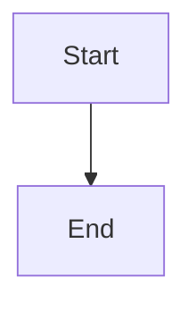

# Blog Repository Retro - b0yu-li.github.io

## Site Overview

**Platform**: Jekyll with Chirpy theme  
**URL**: https://roobystudio.com  
**Timezone**: Asia/Hong_Kong  
**Author**: Boyu Li (boyu)  
**GitHub**: b0yu-li  
**Twitter**: boyu_li

---

## Blog Post Structure

### Location
All blog posts live in `_posts/` directory.

### File Naming Convention
```
YYYY-MM-DD-slug.md
```

**Examples:**
- `2026-10-06-understanding-compaction-in-pi.md`
- `2026-09-06-nodejs-is-electricity.md`
- `2026-03-02-kubernetes-designed-to-be-invisible.md`

**Rules:**
- Date format: `YYYY-MM-DD`
- Slug: lowercase, hyphens, descriptive
- Extension: `.md` (Markdown)

---

## Frontmatter Format

Every blog post must have this frontmatter at the top:

```yaml
---
layout: post
title: "Post Title Here"
author: boyu
date: YYYY-MM-DD HH:MM:SS +0800
categories: [ Category1, Category2 ]
tags: [ tag1, tag2, tag3 ]
description: "Brief description for SEO and preview"
mermaid: true/false
image: /assets/images/headers/filename.png
---
```

### Frontmatter Fields

| Field | Required | Type | Description |
|-------|----------|------|-------------|
| `layout` | ✅ | string | Always `post` |
| `title` | ✅ | string | Post title (use quotes if contains special chars) |
| `author` | ✅ | string | Author identifier (usually `boyu`) |
| `date` | ✅ | datetime | `YYYY-MM-DD HH:MM:SS +0800` format |
| `categories` | ✅ | array | 1-2 categories (e.g., `[ Tech, Backend ]`, `[ Journal, Philosophy ]`) |
| `tags` | ✅ | array | 3-6 relevant tags, lowercase, hyphenated |
| `description` | ✅ | string | SEO description, 1-2 sentences |
| `mermaid` | ❌ | boolean | `true` if post uses Mermaid diagrams |
| `image` | ❌ | string | Header image path: `/assets/images/headers/filename.png` |
| `pin` | ❌ | boolean | `true` to pin post to top of list |

### Categories Used

Common categories in existing posts:
- `Tech` - Technical posts
- `Backend` - Backend development
- `Frontend` - Frontend development
- `Journal` - Personal reflections
- `Philosophy` - Philosophical content
- `Music` - Music production/trance

### Tags Format

- Lowercase
- Hyphenated for multi-word tags
- Examples: `tech`, `node`, `javascript`, `backend`, `event-loop`, `interview`

---

## Directory Structure

```
b0yu-li.github.io/
├── _posts/                    # Blog posts (YYYY-MM-DD-slug.md)
├── _config.yml               # Jekyll configuration
├── assets/
│   └── images/
│       └── headers/          # Header images for posts
├── _data/                    # Data files (navigation, etc.)
├── _plugins/                 # Jekyll plugins
├── tools/                    # Build/run scripts
│   ├── run.sh
│   └── test.sh
├── index.html               # Homepage
└── README.md                # (if exists)
```

---

## Writing Guidelines

### Content Structure

1. **Introduction** - Hook the reader, state what the post covers
2. **Main sections** - Use `##` headers (H2)
3. **Subsections** - Use `###` headers (H3) if needed
4. **Conclusion** - Wrap up key takeaways
5. **Further Reading** (optional) - Links to related resources

### Formatting

- Use **bold** for emphasis
- Use _italics_ for terms, definitions, or foreign words
- Use `code` for technical terms, commands, file names
- Use ```code blocks``` for multi-line code
- Use `> blockquotes` for important quotes or callouts
- Use lists (`+` or `-`) for bullet points
- Use numbered lists for sequential steps

### Code Blocks

Specify language for syntax highlighting:

````markdown
```javascript
const example = "code";
```
````

### Mermaid Diagrams

If `mermaid: true` in frontmatter, use:

````markdown

````

### Images

Header images: `/assets/images/headers/filename.png`  
Inline images: Use relative paths or full URLs

### Links

- Internal: `[Link Text](/path/to/page/)`
- External: `[Link Text](https://example.com)`

---

## Build and Test

### Local Development

```bash
# Using the provided script
./tools/run.sh

# Or manually
bundle exec jekyll serve

# With draft posts
bundle exec jekyll serve --drafts
```

### Testing

```bash
./tools/test.sh
```

### Access

Local: http://localhost:4000

---

## Common Patterns from Existing Posts

### Opening Patterns

1. **Question hook**: Start with a question the reader might have
2. **Scenario**: Describe a relatable situation
3. **Statement**: Bold claim or observation
4. **Quote**: Relevant quote to set the tone

### Section Patterns

1. **What is X?** - Definition and basics
2. **Why does X exist?** - Problem statement
3. **How does X work?** - Mechanism explanation
4. **Practical examples** - Real-world usage
5. **Tips/Best practices** - Actionable advice
6. **Conclusion** - Summary and takeaways

### Closing Patterns

1. **Summary** - Recap key points
2. **Call to action** - What to do next
3. **Further reading** - Links to related content
4. **Question** - Open-ended question for reflection

---

## Checklist for New Posts

- [ ] File named `YYYY-MM-DD-slug.md`
- [ ] Frontmatter complete with all required fields
- [ ] Title is descriptive and engaging
- [ ] Description is 1-2 sentences, SEO-friendly
- [ ] Categories and tags are relevant
- [ ] Date matches file name date
- [ ] Content has clear introduction
- [ ] Content uses proper heading hierarchy (## then ###)
- [ ] Code blocks specify language
- [ ] Images have proper paths
- [ ] Conclusion summarizes key points
- [ ] Proofread for typos and clarity
- [ ] Test locally with `./tools/run.sh`

---

## Notes

- **Timezone**: All dates use `+0800` (Hong Kong time)
- **Author**: Use `boyu` as author identifier
- **Theme**: Chirpy theme provides the layout, don't override `layout: post`
- **SEO**: Description field is used for SEO meta tags
- **Images**: Optimize header images before adding to `/assets/images/headers/`
- **Mermaid**: Only set `mermaid: true` if actually using Mermaid diagrams

---

## Resources

- [Jekyll Documentation](https://jekyllrb.com/docs/)
- [Chirpy Theme Documentation](https://github.com/cotes2020/jekyll-theme-chirpy)
- [Markdown Guide](https://www.markdownguide.org/)
- [Mermaid Documentation](https://mermaid.js.org/)

---

*Last updated: 2026-10-06*
