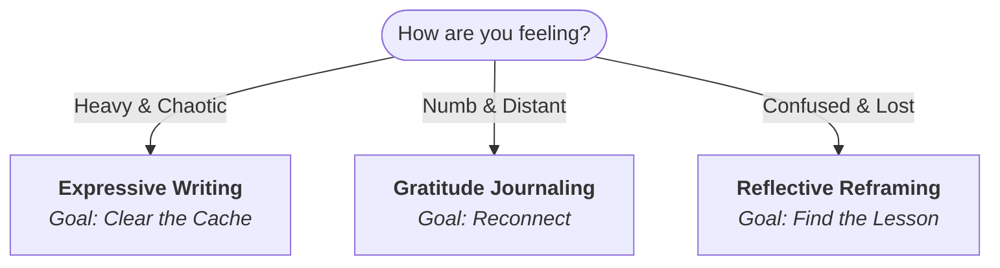
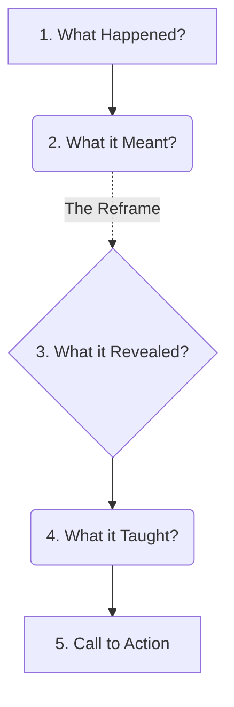

We often treat "journaling" as one generic activity. You sit down, open a notebook, and write "Dear Diary."

But just as you wouldn't use a hammer to cut a steak, you shouldn't use the same writing style for every mental state.
Different problems require different tools.

Over the years, I've categorized my writing practice into three distinct buckets. Here is how I choose which one to use.

## 1. Expressive Writing (For the "Heavy" Days)

**Use this when:** Emotions feel heavy, chaotic, or overwhelming.

This is the "Brain Dump." The goal isn't to be poetic; it's to be empty. When you are angry, anxious, or heartbroken,
your working memory is clogged. Expressive writing clears the cache.

* **The Rule:** Write fast. Don't edit. Burn the paper afterwards if you have to.
* **The Goal:** Get the poison out so you can think clearly again.

## 2. Gratitude Journaling (For the "Numb" Days)

**Use this when:** You feel distant, flat, or uninspired.

Sometimes we aren't sad, we’re just... gray. We are moving through the motions. Gratitude journaling forces your brain
to scan the environment for positives, re-calibrating your reticular activating system (RAS) to spot opportunities.

* **The Rule:** Be specific. "I'm grateful for coffee" is boring. "I'm grateful for the warmth of the mug on a cold
  morning" is grounding.
* **The Goal:** Reconnect with the present moment.

## 3. Reflective Reframing (For the "Confused" Days)

**Use this when:** Life feels confusing, or things didn't go the way you planned.

This is the heavy lifter. It transforms "failure" into "data." It is a structured framework to process events that
didn't make sense to you.

### The Framework

1. **What happened?** (Just the facts)
2. **What it meant?** (The story you told yourself)
3. **What it revealed?** ( The deeper truth about the system or yourself)
4. **What it taught you?** (The lesson)
5. **Call to Action.** (What will you do differently?)

---

## Case Study: The "Performance Review" Trap

To show you how **Reflective Reframing** works, let’s look at a scenario I recently went through.

**The Situation:** I spent the last year working hard and receiving very good feedback. I walked into my performance
review expecting a promotion or a "Exceeds Expectations" rating.

**The Result:** "Meets Expectations."

Here is how I used the framework to process this without spiraling into bitterness.

### 1. What happened?

I worked hard and delivered extra value. I listed evidence to prove I exceeded expectations. Yet, I was given a standard
rating.

### 2. What it meant (Initial Reaction)

I initially thought: *"I am not good enough,"* or *"My manager doesn't see my value,"* or *"I wasted a year of my
life."* I felt cheated.

### 3. What it revealed

It revealed that the corporate ladder is not a meritocracy; it is a bureaucracy. "Exceeding expectations" is often
capped by budget constraints, impressions (perceptions), or office politics, not determined by my actual output. It
revealed that I was measuring my self-worth using a ruler held by someone else.

### 4. What it taught me

It taught me that over-investing in a 9-5 is a high-risk portfolio. I was treating my job like my identity, when it
should be treated like a client. If a client pays for "Standard Service," why am I giving them "Premium Subscription"
for free?

### 5. Call to Action

I will stop chasing the "Exceeds" badge at work. I will do my job well (meet the expectation), but I will reclaim those
extra 10 hours a week.
**New Directive:** Use that reclaimed energy to build my own narrative—my blog, my side projects, and my network—outside
of the office. I will build a ladder that *I* own.

> **The Takeaway**
> Reframing didn't change the bonus check. But it changed my strategy. It turned a moment of defeat into a pivot point
> for freedom.
{: .prompt-tip }
