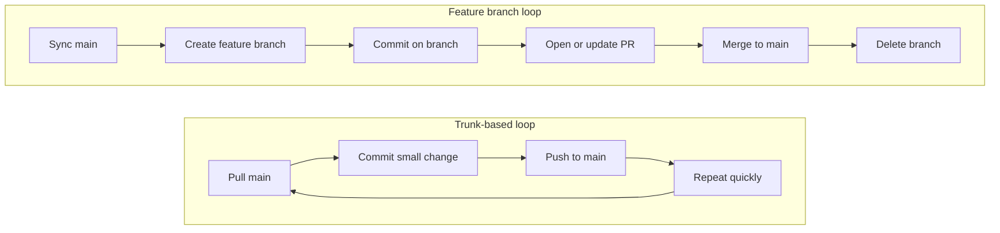

I recently switched IDEs and decided to rely more on the terminal. Here is a documentation of my most frequently used `git` commands.

## 1. Setup & Configuration

+ **Initialize Repository**

```shell
git init
```

+ **Configure User (Per Repository)** _Useful when I need a different identity for a specific project_.

```shell
git config user.name "My Name"
git config user.email "me@example.com"
```

+ **Configure Remote URL** _Note: Use `add` if it's a new remote, or `set-url` to change an existing one_.

```shell
git remote set-url origin https://github.com/username/repo.git
```

## 2. The Daily Loop

+ **Check Status**

```shell
git status
```

+ **Stage Changes**

```shell
git add <file_path>
# Or stage everything
git add .
```

+ **Commit**

```shell
git commit -m "feat: my commit message"
```

+ **View History**

```shell
git log
# Pro tip: One-line view for cleaner history
git log --oneline
```

## 3. Syncing

+ **Pull with Rebase** _Keeps my history clean by moving my local commits on top of the incoming changes_.

```shell
git pull origin main --rebase
```

+ **Push**

```shell
git push origin main
```

## 4. Undo & Corrections

+ **Undo Last Commit (Soft Reset)** _Undoes the last commit but keeps the changes **staged** (ready to be committed again)._

```shell
git reset --soft HEAD~1
```

+ **Restore Staged Files** _Un-stages files (removes them from the index) but keeps my changes_.

```shell
git restore --staged .
```

+ **Amend Last Commit** _Adds staged changes to the previous commit without changing the message_.

```shell
git commit --amend --no-edit
```

+ **Edit Last Commit Message** _Only for local commits that haven't been pushed yet_.

```shell
git commit --amend -m "new message"
```

+ **Edit Older Commit Messages** _Opens an interactive editor. Change `pick` to `reword` next to the commit I want to fix._

```shell
# HEAD~2 means "the last 2 commits"
git rebase -i HEAD~2
```

> Just like `amend`, never do this if you have already pushed these commits to a shared branch, as it rewrites history.
{: .prompt-warning }

## 5. Patching (The Manual Move)

Sometimes I just need to move a commit physically (via email or file) without pushing.

+ **Create Patch for a Single Commit**

  1. Find the Commit Hash:
```shell
git log --oneline
```
  2. Create the `.patch` File: Once I have the commit hash (say it's `abc1234`), use the following command to create a patch:
```shell
git format-patch -1 abc1234
```

+ **Create Patch for Multiple Commits**
  + _Example: Get the last 3 commits_
```shell
git format-patch -3
```
  + _Example: Range from specific commit to HEAD_
```shell
git format-patch abc1234..HEAD
```

+ **Apply Patch**

```shell
git apply /path/to/file.patch
```

## 6. Branching

+ **Create New Branch from Base** _Creates and switches to a new branch based on a specific existing branch (instead of the current HEAD)_.

```shell
git checkout -b <new_branch_name> <base_branch_name>
# Example: Create 'feature-login' starting from 'main'
git checkout -b feature-login main
```

## 7. Feature branch development flow (vs trunk-based)

In a **trunk-based** setup, I usually commit and push small changes to `main` quickly (sometimes directly, sometimes through very short-lived PRs). In a **feature branch** setup, I keep work isolated on a branch, then merge through a PR after review.

**Feature branches trade faster direct integration for clearer review boundaries and safer isolation.**

| **Dimension** | **Trunk-based** | **Feature branch** |
|---|---|---|
| **Where commits go first** | `main` | `feature/*` or `fix/*` |
| **When `main` changes** | Continuously during development | When PR is approved and merged |
| **Review gate** | Usually lightweight or after merge | Usually before merge via PR |
| **Branch lifetime** | Very short or no branch | Short-lived task branch |



+ **Sync `main` before I start**
```shell
git fetch origin
git checkout main
git pull origin main --rebase
```

+ **Create and publish the feature branch**
```shell
git checkout -b feature/my-change main
git push -u origin feature/my-change
```

+ **Work in the branch with the same local loop**
```shell
git add .
git commit -m "feat: implement my change"
git push
```

+ **Staying current with `main` during development** _I don't follow a rigid schedule. I **`fetch`** and rebase onto `origin/main` **whenever it occurs to me** — or after I see `main` move — because **sooner is usually better** for overlap: conflicts stay smaller and I resolve them while the work is still fresh. If `main` is quiet, syncing mainly around PR time can be enough; if it moves fast, I integrate more often. On hectic weeks I sometimes use a light anchor (e.g. start of the day) so I don't accidentally stretch the gap._

+ **After I open the PR — same branch, more pushes** _The PR/MR tracks the **remote** feature branch, so I keep working locally on that branch and push as usual. New commits show up on the same review automatically._

```shell
git add .
git commit -m "fix: address review feedback"
git push
```

+ **Rebase onto `main` when I need a fresh base** _I prefer **`git rebase`** over merge so the branch stays linear. I do this **before** I open the PR, **while** it is open (e.g. after `main` moved), or when I need to re-run CI on a current base — same commands._

```shell
git fetch origin
git checkout feature/my-change
git rebase origin/main
```

If that rebase rewrote commits I had **already pushed**, my local history and the remote branch no longer line up, so a normal `git push` is rejected.

+ **`git push --force-with-lease`** _After a rebase or `amend` on published commits, I have to replace the remote branch tip to match my new history. **`--force-with-lease` is a guarded force push:** Git checks that the remote branch is still where I last thought it was (from my recent `fetch`). If someone else pushed first, the push aborts instead of overwriting their commits. A plain `git push --force` skips that check._

_I refresh `git fetch origin` before rebasing and before the force push so the “lease” compares against an up-to-date picture of the remote._

```shell
git push --force-with-lease
```

+ **Cleanup after merge**
```shell
git checkout main
git pull origin main --rebase
git branch -d feature/my-change
git push origin --delete feature/my-change
```

_If my repo uses squash/rebase merge and `git branch -d` says “not fully merged,” I verify the branch is already in `main`, then delete it with `git branch -D feature/my-change`._

> If my feature branch is **shared** — someone else pushes to it, or bases their work on it — I treat **`git rebase` + `git push --force-with-lease` as a team decision**, not a solo convenience trick.
>
> **Why:** Rebase and amend **replace commits** with new hashes. My collaborators may still have the old chain locally or in their PRs. After I force-push, their history and mine diverge in ways that are tedious to untangle (duplicate changes, confusing merges, “where did this commit go?”).
>
> **`--force-with-lease` helps, but it is not a green light for shared branches.** It only refuses to clobber the remote if the tip moved since my last `fetch`. It does **not** fix the fact that others already built on the commits I threw away.
>
> **What I usually do instead:** pull `main` into my branch with **`git merge origin/main`** (no force push), or agree upfront that this branch is **mine only** until the PR lands — then rebase is fine.
{: .prompt-warning }

## 8. Notes

_Small tangents and naming — not part of the command loops above._

+ **Pull Request vs Merge Request** _GitHub’s **Pull Request** comes from the fork-and-contribute flow: I publish commits, then I ask someone to **pull** them into the upstream repo. GitLab’s **Merge Request** names the operation instead: **merge** this branch into the target branch. **Same review step, different metaphor.** I write **PR/MR** earlier in this post so readers from either platform know what I mean._
