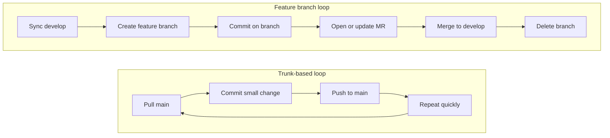

I recently switched IDEs and decided to rely more on the terminal. Here is a documentation of my most frequently used `git` commands.

## 1. Setup & Configuration

+ **Initialize Repository**

```shell
git init
```

+ **Configure User (Per Repository)** _Useful when I need a different identity for a specific project_.

```shell
git config user.name "My Name"
git config user.email "me@example.com"
```

+ **Configure Remote URL** _Note: Use `add` if it's a new remote, or `set-url` to change an existing one_.

```shell
git remote set-url origin https://github.com/username/repo.git
```

## 2. The Daily Loop

+ **Check Status**

```shell
git status
```

+ **Stage Changes**

```shell
git add <file_path>
# Or stage everything
git add .
```

+ **Commit**

```shell
git commit -m "feat: my commit message"
```

+ **View History**

```shell
git log
# Pro tip: One-line view for cleaner history
git log --oneline
```

## 3. Syncing

+ **Pull with Rebase** _Keeps my history clean by moving my local commits on top of the incoming changes_.

```shell
git pull origin main --rebase
```

+ **Push**

```shell
git push origin main
```

## 4. Undo & Corrections

+ **Undo Last Commit (Soft Reset)** _Undoes the last commit but keeps the changes **staged** (ready to be committed again)._

```shell
git reset --soft HEAD~1
```

+ **Restore Staged Files** _Un-stages files (removes them from the index) but keeps my changes_.

```shell
git restore --staged .
```

+ **Amend Last Commit** _Adds staged changes to the previous commit without changing the message_.

```shell
git commit --amend --no-edit
```

+ **Edit Last Commit Message** _Only for local commits that haven't been pushed yet_.

```shell
git commit --amend -m "new message"
```

+ **Edit Older Commit Messages** _Opens an interactive editor. Change `pick` to `reword` next to the commit I want to fix._

```shell
# HEAD~2 means "the last 2 commits"
git rebase -i HEAD~2
```

> Just like `amend`, never do this if you have already pushed these commits to a shared branch, as it rewrites history.
{: .prompt-warning }

## 5. Patching (The Manual Move)

Sometimes I just need to move a commit physically (via email or file) without pushing.

+ **Create Patch for a Single Commit**

  1. Find the Commit Hash:
```shell
git log --oneline
```
  2. Create the `.patch` File: Once I have the commit hash (say it's `abc1234`), use the following command to create a patch:
```shell
git format-patch -1 abc1234
```

+ **Create Patch for Multiple Commits**
  + _Example: Get the last 3 commits_
```shell
git format-patch -3
```
  + _Example: Range from specific commit to HEAD_
```shell
git format-patch abc1234..HEAD
```

+ **Apply Patch**

```shell
git apply /path/to/file.patch
```

## 6. Branching

+ **Create New Branch from Base** _Creates and switches to a new branch based on a specific existing branch (instead of the current HEAD)_.

```shell
git checkout -b <new_branch_name> <base_branch_name>
# Example: Create 'feature-login' starting from 'main'
git checkout -b feature-login main
```

## 7. Feature branch development flow (vs trunk-based)

In a **trunk-based** setup, I usually commit and push small changes to `main` quickly (sometimes directly, sometimes through very short-lived MRs). In a **feature branch** setup, I keep work isolated on a branch, then merge through an MR to `develop` after review.

**Feature branches trade faster direct integration for clearer review boundaries and safer isolation.**

| **Dimension** | **Trunk-based** | **Feature branch** |
|---|---|---|
| **Where commits go first** | `main` | `feature/*` or `fix/*` |
| **When integration branch changes** | Continuously during development (`main`) | When MR is approved and merged (`develop`) |
| **Review gate** | Usually lightweight or after merge | Usually before merge via MR |
| **Branch lifetime** | Very short or no branch | Short-lived task branch |



+ **Sync `develop` before I start**
```shell
git fetch origin
git checkout develop
git pull origin develop --rebase
```

+ **Create and publish the feature branch**
```shell
git checkout -b feature/my-change develop
git push -u origin feature/my-change
```

+ **Work in the branch with the same local loop**
```shell
git add .
git commit -m "feat: implement my change"
git push
```

+ **Staying current with `develop` during development**
    + I do not follow a rigid schedule.
    + I `fetch` and rebase onto `origin/develop` whenever it occurs to me, or right after I notice `develop` moved.
    + **Why I sync early:** conflicts are usually smaller, and I resolve them while context is still fresh.
    + **How I adapt cadence:** if `develop` is quiet, syncing around MR time can be enough; if it moves fast, I integrate more often.

+ **After I open the MR (PR on GitHub) — same branch, more pushes**
    + The MR tracks the remote feature branch.
    + I keep working on the same local branch and push as usual; new commits appear in the same review automatically.

```shell
git add .
git commit -m "fix: address review feedback"
git push
```

+ **Rebase onto `develop` when I need a fresh base**
    + I prefer `git rebase` over merge so my branch history stays linear.
    + I use the same commands before opening the MR, while the MR is open (for example, after `develop` moves), or when I need CI on a fresh base.

```shell
git fetch origin
git checkout feature/my-change
git rebase origin/develop
```

+ **What each line in that block does** — _Unpacking the three commands above — same shape as updating from `main` in **Syncing** (`git pull origin main --rebase`): refresh what the remote knows, then replay my commits on top of the latest integration branch. Here that branch is `develop`, so I target `origin/develop`._
    + **Step 1 — Refresh remote state with `git fetch origin`:**
        + `origin` is the remote alias. This `fetch` updates local remote-tracking refs (like `origin/develop`) without changing my working files.
    + **Step 2 — Stay on my feature branch:**
        + I run the rebase while checked out on `feature/my-change` (not on `develop` itself).
    + **Step 3 — Rebase onto the refreshed base with `git rebase origin/develop`:**
        + Git takes commits on my current branch that are not in `origin/develop` and replays them on top of the latest `origin/develop`.
    + **Why this order matters:**
        + I fetch first so I do not accidentally rebase onto stale remote history.
+ **If conflicts appear, I resolve files, then continue:**

```shell
git add <resolved_files>
git rebase --continue
# Or bail out and return to pre-rebase state
git rebase --abort
```

+ **If I already pushed this branch before the rebase**
    + Rebase rewrites commit hashes. If those commits were already pushed, local and remote history no longer line up, so a normal `git push` is rejected.
    + The follow-up push usually needs `git push --force-with-lease`.
    + I refresh `git fetch origin` before rebasing and before force-pushing so the lease compares against current remote state.

+ **`git push --force-with-lease` after rebase or amend on published commits**
    + I use this when I must replace the remote tip to match rewritten local history.
    + `--force-with-lease` is a guarded force push: it only updates when the remote tip is still what I last fetched.
    + If someone else pushed first, Git aborts instead of overwriting their commits.
    + A plain `git push --force` skips this safety check.

```shell
git push --force-with-lease
```

+ **Cleanup after merge** - I first update local `develop`, then remove the feature branch locally and on remote.
```shell
git checkout develop
git pull origin develop --rebase
git branch -d feature/my-change
git push origin --delete feature/my-change
```

_If my repo uses squash/rebase merge and `git branch -d` says "not fully merged," I verify the branch is already in `develop`, then delete it with `git branch -D feature/my-change`._

> If my feature branch is **shared** — someone else pushes to it, or bases their work on it — I treat **`git rebase` + `git push --force-with-lease` as a team decision**, not a solo convenience trick.
>
> **Why:** Rebase and amend **replace commits** with new hashes. My collaborators may still have the old chain locally or in their MRs/PRs. After I force-push, their history and mine diverge in ways that are tedious to untangle (duplicate changes, confusing merges, “where did this commit go?”).
>
> **`--force-with-lease` helps, but it is not a green light for shared branches.** It only refuses to clobber the remote if the tip moved since my last `fetch`. It does **not** fix the fact that others already built on the commits I threw away.
>
> **What I usually do instead:** pull `develop` into my branch with **`git merge origin/develop`** (no force push), or agree upfront that this branch is **mine only** until the MR lands — then rebase is fine.
{: .prompt-warning }

## 8. Notes

_Small tangents and naming — not part of the command loops above._

+ **Merge Request vs Pull Request** _I default to **Merge Request** in this post because that is my day-to-day wording. On GitHub, the equivalent term is **Pull Request**. **Same review step, different metaphor.** I mention both where it helps cross-platform readers._
