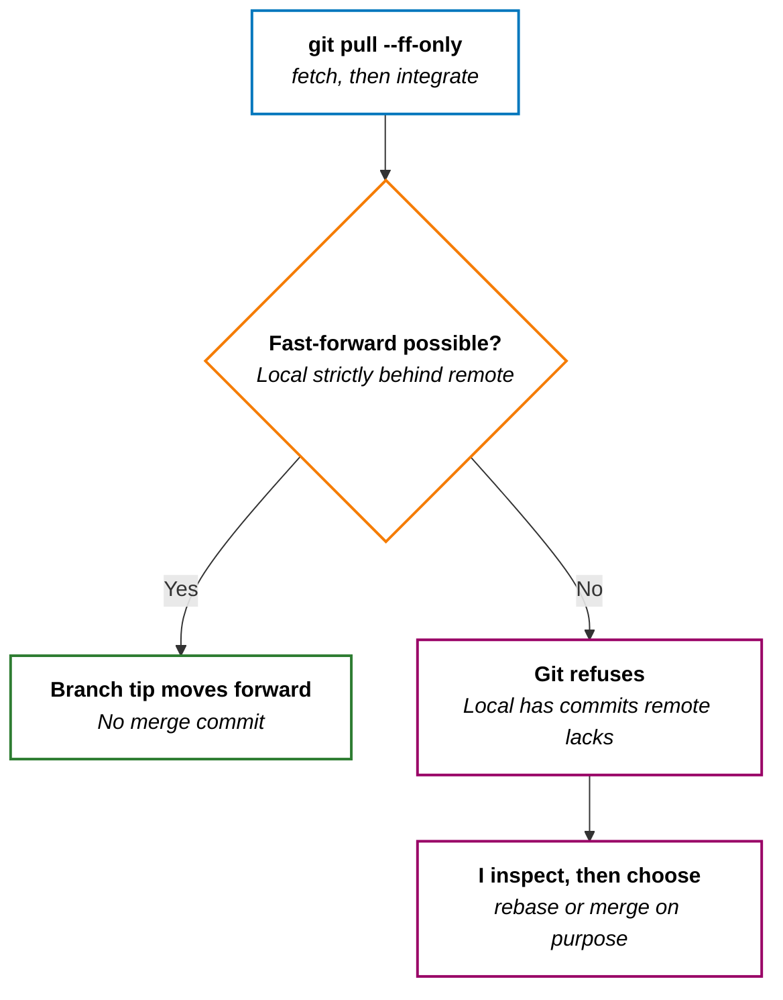
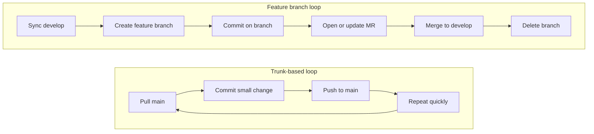

I recently switched IDEs and decided to rely more on the terminal. Here is a documentation of my most frequently used `git` commands.

**How to read this post:** **§1–6** are quick reference cards; **§7** is my feature-branch workflow — when I rebase vs merge, and what Git is doing under the hood.

## 1. Setup & Configuration

+ **Initialize Repository**

```shell
git init
```

+ **Configure User (Per Repository)** _Useful when I need a different identity for a specific project_.

```shell
git config user.name "My Name"
git config user.email "me@example.com"
```

+ **Configure Remote URL** _Note: Use `add` if it's a new remote, or `set-url` to change an existing one_.

```shell
git remote set-url origin https://github.com/username/repo.git
```

## 2. The Daily Loop

+ **Check Status**

```shell
git status
```

+ **Stage Changes**

```shell
git add <file_path>
# Or stage everything
git add .
```

+ **Commit**

```shell
git commit -m "feat: my commit message"
```

+ **View History**

```shell
git log
# Pro tip: One-line view for cleaner history
git log --oneline
```

## 3. Syncing

+ **Pull fast-forward only** _Catch up with the remote only when my branch can move forward cleanly — if local and remote have diverged, Git stops instead of creating a merge commit I did not plan for._

```shell
git pull origin main --ff-only
```



+ **What it does:** same `fetch` + integrate as a normal `git pull`, but Git refuses unless a **fast-forward** is possible — my branch is strictly behind the remote, with no local-only commits blocking a straight pointer move.
+ **When I use it:** on **`main`** or **`develop`** when I only mirror the remote and do not commit on that branch locally. If pull fails, I inspect stray local commits before I rebase or merge on purpose.
+ **vs `git pull --rebase`:** `--rebase` replays my local commits on top of incoming changes; `--ff-only` does not — it either fast-forwards or errors. I reach for `--ff-only` when I expect no local commits; `--rebase` when I do.

+ **Pull with Rebase** _Keeps my history clean by moving my local commits on top of the incoming changes_.

```shell
git pull origin main --rebase
```

+ **Push**

```shell
git push origin main
```

## 4. Undo & Corrections

+ **Undo Last Commit (Soft Reset)** _Undoes the last commit but keeps the changes **staged** (ready to be committed again)._

```shell
git reset --soft HEAD~1
```

+ **Restore Staged Files** _Un-stages files (removes them from the index) but keeps my changes_.

```shell
git restore --staged .
```

+ **Amend Last Commit** _Adds staged changes to the previous commit without changing the message_.

```shell
git commit --amend --no-edit
```

+ **Edit Last Commit Message** _Only for local commits that haven't been pushed yet_.

```shell
git commit --amend -m "new message"
```

+ **Edit Older Commit Messages** _Opens an interactive editor. Change `pick` to `reword` next to the commit I want to fix._

```shell
# HEAD~2 means "the last 2 commits"
git rebase -i HEAD~2
```

> Just like `amend`, never do this if you have already pushed these commits to a shared branch, as it rewrites history.
{: .prompt-warning }

## 5. Patching (The Manual Move)

Sometimes I just need to move a commit physically (via email or file) without pushing.

+ **Create Patch for a Single Commit**

  1. Find the Commit Hash:
```shell
git log --oneline
```
  2. Create the `.patch` File: Once I have the commit hash (say it's `abc1234`), use the following command to create a patch:
```shell
git format-patch -1 abc1234
```

+ **Create Patch for Multiple Commits**
  + _Example: Get the last 3 commits_
```shell
git format-patch -3
```
  + _Example: Range from specific commit to HEAD_
```shell
git format-patch abc1234..HEAD
```

+ **Apply Patch**

```shell
git apply /path/to/file.patch
```

## 6. Branching

+ **Create New Branch from Base** _Creates and switches to a new branch based on a specific existing branch (instead of the current HEAD)_.

```shell
git checkout -b <new_branch_name> <base_branch_name>
# Example: Create 'feature-login' starting from 'main'
git checkout -b feature-login main
```

---

## 7. Feature branch development flow (vs trunk-based)

In a **trunk-based** setup, I usually commit and push small changes to `main` quickly (sometimes directly, sometimes through very short-lived MRs). In a **feature branch** setup, I keep work isolated on a branch, then merge through an MR to `develop` after review.

**Feature branches trade faster direct integration for clearer review boundaries and safer isolation.**

| **Dimension** | **Trunk-based** | **Feature branch** |
|---|---|---|
| **Where commits go first** | `main` | `feature/*` or `fix/*` |
| **When integration branch changes** | Continuously during development (`main`) | When MR is approved and merged (`develop`) |
| **Review gate** | Usually lightweight or after merge | Usually before merge via MR |
| **Branch lifetime** | Very short or no branch | Short-lived task branch |



### Conventions in this section

+ **Integration branch:** In §7, **`develop`** is where approved work lands. If your team integrates into **`main`** instead, use `origin/main` everywhere I write `origin/develop` — the commands are the same.
+ **Merge Request vs Pull Request:** I default to **Merge Request** because that is my day-to-day wording. On GitHub, the equivalent is **Pull Request** — same review step, different metaphor.
+ **`origin/<branch>` is not the live remote.** Names like `origin/develop` are **remote-tracking refs**: local bookmarks updated by `git fetch`. I always `fetch` before I rebase or merge onto them.

---

### Start a branch

+ **Sync `develop` before I start** _I do not commit on `develop` locally, so I often use `--ff-only` here — see **Syncing** §3. If pull fails, I check for stray local commits before I rebase or merge._

```shell
git fetch origin
git checkout develop
git pull origin develop --ff-only
```

+ **Create and publish the feature branch** _Same idea as **Branching** §6 — here the base is `develop`._

```shell
git checkout -b feature/my-change develop
git push -u origin feature/my-change
```

---

### Work and review

+ **Work in the branch with the same local loop** _Same rhythm as **The Daily Loop** §2._

```shell
git add .
git commit -m "feat: implement my change"
git push
```

+ **After I open the MR — same branch, more pushes**
    + The MR tracks the remote feature branch.
    + I keep working on the same local branch and push as usual; new commits appear in the same review automatically.

```shell
git add .
git commit -m "fix: address review feedback"
git push
```

---

### Stay current on a feature branch

**I pull `develop` (or `main`) into my feature branch while I am still working — not on a fixed schedule.**

+ I `fetch` and integrate whenever it occurs to me, or right after I notice the integration branch moved.
+ **Why I sync early:** conflicts are usually smaller, and I resolve them while context is still fresh.
+ **How I adapt cadence:** if `develop` is quiet, syncing around MR time can be enough; if it moves fast, I integrate more often.

Every integration path below follows the same shape: **`fetch` → stay on the feature branch → rebase or merge onto `origin/<integration-branch>`**. I never run these while checked out on `develop` itself.

| **I want…** | **I usually use…** | **Trade-off** |
|---|---|---|
| Linear history on a **solo** feature branch | `git rebase origin/develop` | Rewrites my commits; may need `--force-with-lease` if already pushed |
| Updates **without** rewriting published commits | `git merge origin/develop` | May add a merge commit; normal `git push` afterward |
| A **shared** feature branch (others push to it) | `git merge origin/develop` | See the warning at the end of §7 |

#### Rebase onto the integration branch

+ I prefer rebase when the branch is **mine only** and I want a straight commit line before or during the MR.

```shell
git fetch origin
git checkout feature/my-change
git rebase origin/develop
```

+ **What Git does:** take commits on my current branch that are not in `origin/develop`, and **replay** them on top of the latest `origin/develop`. Same idea as `git pull origin main --rebase` in **Syncing** §3 — here the integration branch is `develop`.
+ **Why `fetch` first:** so `origin/develop` is current; otherwise I rebase onto stale history.

#### Merge the integration branch

+ On a feature branch, **`git merge origin/develop`** brings the integration branch's new commits **into** my branch instead of replaying mine on top.

```shell
git fetch origin
git checkout feature/my-change
git merge origin/develop
```

+ **What Git does:** find commits in `origin/develop` that my branch does not have yet, combine them with my work, and move my branch tip forward. My existing feature commits **keep the same hashes**.
+ **Fast-forward vs merge commit:** if I have no unique commits, Git may fast-forward with no merge commit. If both sides diverged, Git records a **merge commit** with two parents.
+ **Rebase vs merge in one line:** rebase puts *my* commits on top of `develop` and rewrites history; merge pulls *develop's* commits into my branch and keeps both histories visible.

#### Conflicts, push after rebase, and force-with-lease

+ **After a merge conflict:** edit files, `git add` resolutions, then `git commit` (merge message if Git prompts). Cancel with `git merge --abort`.
+ **After a rebase conflict:** edit files, `git add` resolutions, then:

```shell
git rebase --continue
# Or return to pre-rebase state
git rebase --abort
```

+ **If I already pushed this branch before a rebase:** rebase replaces commit hashes, so a normal `git push` is rejected. I `fetch` again, then:

```shell
git push --force-with-lease
```

+ **`--force-with-lease` is a guarded force push** — it updates the remote only if the tip still matches what I last fetched. If someone else pushed first, Git aborts. A plain `git push --force` skips that check. I use this after rebase or amend on commits that were already published; I avoid it when others share the branch (see below).

---

### After the MR merges

+ I update local `develop`, then remove the feature branch locally and on the remote.

```shell
git checkout develop
git pull origin develop --ff-only
git branch -d feature/my-change
git push origin --delete feature/my-change
```

_If my repo uses squash/rebase merge and `git branch -d` says "not fully merged," I verify the branch is already in `develop`, then delete it with `git branch -D feature/my-change`._

---

> **Shared feature branch → I merge, I do not rebase.** If someone else pushes to the branch or bases their work on my commits, I stay current with **`git merge origin/develop`** (see **Stay current** above) so I do not rewrite history others already have.
>
> **Why I avoid rebase here:** rebase and amend **replace commits** with new hashes. My collaborators may still have the old chain locally or in their MRs/PRs. If I rebase and then force-push, our histories diverge in tedious ways (duplicate changes, confusing merges, “where did this commit go?”).
>
> **`--force-with-lease`** only guards the remote tip — it won’t push if someone else updated the branch since my last `fetch`. It does not update my teammates’ clones after I rebase and replace commits they may already have.
>
> **When rebase is fine:** the branch is **mine only** until the MR lands — or the team has explicitly agreed we may rebase and force-push on that branch.
{: .prompt-warning }
