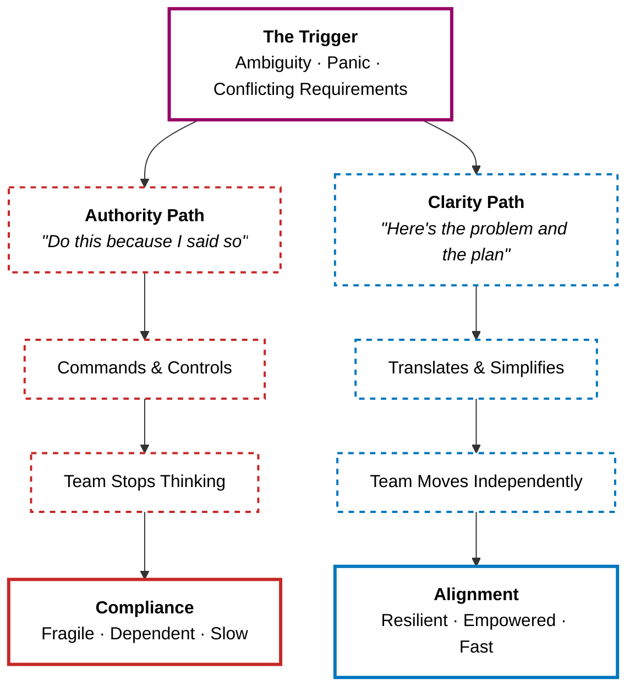

A common trap in our industry is confusing **seniority** with **authority**. 

We often assume that as we climb the ladder, our job becomes telling people what to do. But as we explored in the first volume of this playbook, using authority ("carrots and sticks") is **the weakest form of leadership**. 

> The true mark of a senior contributor or leader is not how many people report to them, nor how loudly they can dictate architecture. It is the ability to walk into a room full of ambiguity, panic, or conflicting requirements, and walk out with **clarity**.

---

### The Myth of Authority

When someone relies on authority, they operate under the illusion that because they have a title, their ideas are inherently better. 
+ **The approach:** "Do this because I said so, and I am the Senior/Lead."
+ **The result:** The team stops thinking. They wait for orders. If the leader makes a mistake, the whole project goes down because no one felt empowered to challenge the premise. 

When you rely on authority, you are commanding. And if you approach your team with the attitude of "I need you to do this FOR me," you will ultimately fail.

### The Reality of Clarity

**Seniority is an exercise in translation**. It is the process of taking chaos—vague client requests, shifting business goals, tangled legacy code—and distilling it into a path forward. 

**Clarity is King.** If a task is confusing, people will procrastinate because they don't know where to start. A senior's primary job is to remove that confusion.

#### How to Bring Clarity to Your Team

**1. Define the Real Problem**

**Junior engineers answer questions. Senior engineers question the answers.** Before writing a line of code or assigning a task, the senior leader ensures everyone understands *why* they are doing it. They anchor everything in "The Why".

**2. Absorb Ambiguity, Project Focus**

The business side is inherently messy. A senior leader acts as a buffer. They absorb the stress of changing deadlines and conflicting stakeholder opinions, and they output clean, actionable priorities for the team. 

**3. Set the "Definition of Done"**

**Ambiguity kills motivation.** A senior leader ensures everyone knows exactly what a successful outcome looks like so energy isn't wasted guessing. They define the "What" and leave the "How" to the team (providing Autonomy).

**4. Break Things Down**

When faced with a massive, intimidating project, the senior leader steps in to create micro-goals. They turn the "big thing" into comically small, achievable steps so the team can build momentum.

### Clarity in Action

The principles above sound nice in theory. Let's see what they look like under pressure.

**Scenario 1: The Production Fire**

A critical payment service starts failing on a Friday afternoon.

+ **The Authority Response:** The lead jumps in and barks, "Everyone stop what you're doing. Deploy this hotfix NOW. I don't have time to explain." The team scrambles. Nobody fully understands the root cause. Two developers accidentally work on the same file. The hotfix introduces a regression because no one felt confident enough to question the approach.

+ **The Clarity Response:** The lead gathers the team for a two-minute standup: "Here's the situation — our payment service is timing out because the database connection pool is exhausted under the current traffic spike. The fix has two parts: Alice, can you increase the pool limit in the config? Bob, can you add a circuit breaker to the payment client so we fail gracefully? We need both merged within the hour." Everyone moves independently, in parallel, with zero confusion.

Same crisis, same urgency. But the clarity-driven leader turned panic into **parallel execution** by making the _problem_, the _plan_, and each person's _role_ obvious.

---

**Scenario 2: The Vague New Feature**

A product manager walks in: "We need a notification system. Clients are complaining."

+ **The Authority Response:** The lead turns to the team and says, "You heard them. Build a notification system. I want it done in two sprints." The team spends the first three days debating scope — do we need email? Push? SMS? In-app? What events trigger notifications? By the end of sprint one, they have a half-built, over-engineered system that nobody is confident about.

+ **The Clarity Response:** The lead absorbs the ambiguity and returns to the team with this: "The real problem is that users don't know when their order status changes. Here's what _done_ looks like for V1 — an email is sent within 60 seconds when an order is confirmed, shipped, or delivered. We'll use our existing event bus. SMS and push are out of scope until Q3." The team starts building on day one.

The authority-driven leader passed the chaos straight through to the team. The clarity-driven leader _absorbed_ it and gave back **a focused, achievable mission**. That is the difference.

---

### Authority vs. Clarity

| Metric | The Authority-Driven Leader | The Clarity-Driven Leader |
| :--- | :--- | :--- |
| **Reaction to Chaos** | Issues commands to regain control. | Pauses, asks questions, maps the problem. |
| **Team Dynamic** | Hub-and-spoke (everyone reports to the leader). | Empowered (the team moves independently toward a clear goal). |
| **Delegation** | Hands out specific, rigid tasks. | Defines the goal, releases the method. |
| **Value Add** | Their title and decision-making power. | Their ability to simplify the complex. |

### The Takeaway

> Authority forces compliance. Clarity creates alignment. 

> **Compliance** means people do what they're told — they follow the letter of the instruction, but they stop there. If the instruction is wrong, they follow it anyway. If a gap appears, they wait for the next order. The team moves, but only because it was pushed.
>
> **Alignment** means people understand the destination — they can make judgment calls, fill gaps on their own, and course-correct without asking permission. The team moves because it _wants to reach the same place_.
{: .prompt-tip }

If you want to step into a senior role—whether as an engineer, a designer, or a manager—stop worrying about how to get people to listen to your orders. Instead, focus on becoming **the person who makes the next step obvious** for everyone around you.