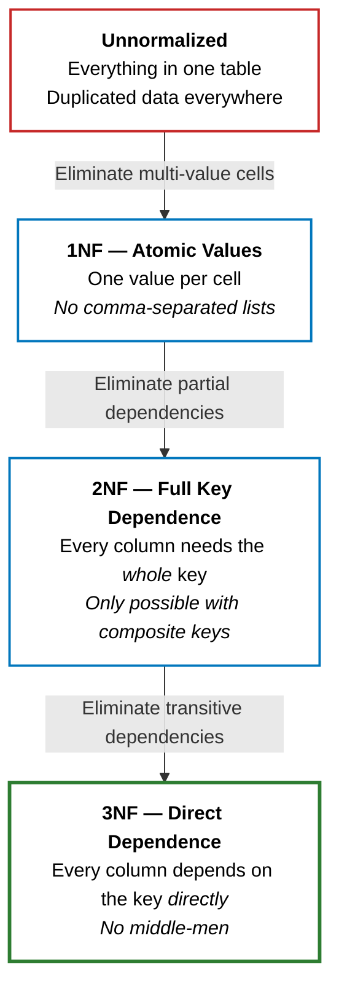

> A bad API can be versioned. A bad database schema haunts you forever.

I've learned this the hard way: the database is the foundation of everything. I can refactor code, version my APIs, rebuild the frontend — but a poorly designed database will slowly poison everything that touches it. Migrations are risky, data is hard to move, and by the time I realize the schema is wrong, half my codebase has grown around its shape.

**Normalization** is the process of structuring tables so that data is stored cleanly, without duplication or hidden dependencies. There are more than three normal forms, but in practice, **the first three are the ones that matter**. If my schema satisfies 3NF, I'm ahead of most production databases I've seen.

The way I think about it: imagine organizing a **filing cabinet** for a company. Every piece of information should live in exactly one folder, and every folder should be about exactly one thing. If I dump everything into one giant folder, I'll find the same customer's address scribbled on fifty invoices — and when they move, I'll have to find and fix all fifty.

> If this diagram doesn't make sense yet, don't worry — read on and come back to it after the examples. It'll click.
{: .prompt-tip }

---

## 1️⃣ 1NF: One Value, One Cell

**First Normal Form** says: every column holds a single, atomic value. No comma-separated lists. No arrays crammed into a text field.

I've seen this pattern more times than I'd like to admit:

| order_id | customer | products |
|---|---|---|
| 1 | Alice | Widget, Gadget, Gizmo |
| 2 | Bob | Widget |

Seems compact and convenient. Now try to answer this: **how would you write a query to find all orders that contain "Gadget"?** I'd have to parse a comma-separated string — `LIKE '%Gadget%'` — which is fragile, can't use an index, and would also match a product called "SuperGadget". What about counting how many products each order has? More string splitting. The moment I need to _query_ the data inside that column, the design falls apart.

**Challenge:** before reading on, how would you redesign this table so that querying for a single product is straightforward?

The fix — give each product its own row, or (better) extract products into a separate table:

| order_id | product |
|---|---|
| 1 | Widget |
| 1 | Gadget |
| 1 | Gizmo |
| 2 | Widget |

**The rule I follow:** if I'm tempted to store a comma-separated list in a column, I'm violating 1NF. Stop and create a related table instead.

---

## 2️⃣ 2NF: Every Column Depends on the Full Key

**Second Normal Form** builds on 1NF and says: every non-key column must depend on _the entire_ primary key, not just part of it. This only matters when I have a **composite key** (a primary key made of two or more columns).

Let me walk through an example. Say I have an `order_items` table. A single order can contain multiple products, and the same product can appear in multiple orders. Neither `order_id` nor `product_id` alone can uniquely identify a row — but _together_ they can. That combination is called a **composite key**: a primary key made of two or more columns. Here, the composite key is `(order_id, product_id)`:

| order_id | product_id | quantity | product_name | product_price |
|---|---|---|---|---|
| 1 | 101 | 2 | Widget | 9.99 |
| 1 | 102 | 1 | Gadget | 19.99 |
| 2 | 101 | 5 | Widget | 9.99 |

Looks reasonable at first glance. Now ask yourself: **what happens when the Widget's price changes to 12.99?** I'd have to find and update _every row_ where `product_id = 101` appears. Miss one, and my data contradicts itself — the same product with two different prices.

The root cause: `product_name` and `product_price` depend only on `product_id` — they have nothing to do with `order_id`. That's a **partial dependency**. These columns don't need the full composite key to be determined; they only need half of it.

**Challenge:** how would you restructure this table so that a price change only requires updating a single row?

The fix — extract product info into its own table:

**`order_items`**

| order_id | product_id | quantity |
|---|---|---|
| 1 | 101 | 2 |
| 1 | 102 | 1 |
| 2 | 101 | 5 |

**`products`**

| product_id | product_name | product_price |
|---|---|---|
| 101 | Widget | 9.99 |
| 102 | Gadget | 19.99 |

Now each fact lives in exactly one place. Price changes happen in one row.

---

## 3️⃣ 3NF: No Middle-Men

**Third Normal Form** says: no **transitive dependencies**. A non-key column should depend on the primary key directly — not through another non-key column.

Let's have a look at this `employees` table:

| employee_id | employee_name | department_id | department_name | department_head |
|---|---|---|---|---|
| 1 | Alice | D10 | Engineering | Charlie |
| 2 | Bob | D10 | Engineering | Charlie |
| 3 | Carol | D20 | Marketing | Diana |

Everything looks correct. But now: **what happens when the Engineering department gets a new head?** I'd need to update every row where `department_id = D10`. And if Alice's row says the head is "Charlie" while Bob's row already says "Eve," which one is right? The same fact — who leads Engineering — is duplicated across rows, and duplicated facts eventually contradict each other.

The root cause: `department_name` and `department_head` don't really depend on `employee_id`. They depend on `department_id`, which _itself_ depends on `employee_id`. The dependency chain is: `employee_id → department_id → department_name`. That's a **transitive dependency** — a column reaching the key only through a middle-man.

**Challenge:** how would you split this table so that department info lives in exactly one place, no matter how many employees belong to it?

The fix is the same pattern — extract the transitive dependency into its own table:

**`employees`**

| employee_id | employee_name | department_id |
|---|---|---|
| 1 | Alice | D10 |
| 2 | Bob | D10 |
| 3 | Carol | D20 |

**`departments`**

| department_id | department_name | department_head |
|---|---|---|
| D10 | Engineering | Charlie |
| D20 | Marketing | Diana |

There's a famous one-liner that summarizes all three normal forms at once:

> _"The key, the whole key, and nothing but the key — so help me Codd."_

Each phrase maps to one form:

+ **"The key"** → **1NF.** Every row is uniquely identified by a key, and every cell holds a single atomic value.
+ **"The whole key"** → **2NF.** Every column depends on _the whole key_ — not just part of a composite key.
+ **"Nothing but the key"** → **3NF.** Every column depends on _nothing but the key_ — no sneaking through a middle-man column.

> "So help me **Codd**" is a pun on "so help me God." [Edgar F. Codd](https://en.wikipedia.org/wiki/Edgar_F._Codd) was the British computer scientist who invented the relational database model in 1970 — the foundation behind SQL, tables, and the normal forms themselves.
{: .prompt-info }

---

## 🤔 Wait — How Is 3NF Different from 2NF?

Both end with the same fix — extract columns into a new table. So what's actually different? Let's go back to the two examples.

**The 2NF problem — "I only need _part_ of your key."**

The `order_items` table had a two-part key: `(order_id, product_id)`. But `product_name` didn't care about `order_id` at all. If I told it only the `product_id`, it could already give me the answer. It was sitting in a table whose key was _too big_ for it — it only needed half.

> `product_name`: "You keep telling me the `order_id`, but I don't need it. Just give me the `product_id` and I'll tell you the name."

**The 3NF problem — "I don't belong to _you_. I belong to that other column."**

The `employees` table had a single key: `employee_id`. If I ask "what's the department name for employee 1?", I _can_ answer — look up Alice, see she's in D10, then recall that D10 is Engineering. But notice the two hops: I went from `employee_id` to `department_id`, and _then_ from `department_id` to `department_name`. I needed a middle-man.

Here's my litmus test: if I change Alice's department from D10 to D20, does "Engineering" still make sense in her row? No — because `department_name` was never really about Alice. It was about whatever `department_id` happened to be sitting next to it.

> `department_name`: "You're asking me about employee 1, but I don't actually know anything about employees. Give me a `department_id` — _that's_ the question I answer."

**The one-line distinction:** 2NF says _"don't store me with a key that's bigger than I need."_ 3NF says _"don't store me with a key that isn't my real owner."_

| | **2NF Problem** | **3NF Problem** |
|---|---|---|
| **The column says** | "I only need _part_ of your key" | "I belong to a _different_ column, not your key" |
| **Can only happen with** | Composite keys (2+ columns) | Any key — single or composite |
| **How to spot it** | A column ignores one part of the composite key | A column describes another non-key column, not the row itself |

---

## 🪄 The Decomposition Framework

The three normal forms give me the _why_. Here's the _how_ — a systematic method I apply to any table, without relying on intuition.

**Step 1: List every column and identify the primary key.**

I write out all the columns and determine what uniquely identifies a row — a single column or a composite key.

**Step 2: For each non-key column, ask: "What is the _minimal_ set of columns that determines this value?"**

This is the key question. I don't ask "is this column related to the table?" — I ask "what do I need to _know_ to look up this column's value?" That minimal set is called the column's **determinant**.

**Step 3: Group columns by their determinant.**

Columns that share the same determinant belong together. Each distinct determinant group becomes its own table, with the determinant as its primary key.

**Step 4: Link the tables.**

The original table keeps only the columns whose determinant is its own primary key, plus foreign key references to the new tables.

Let me walk through a messy table to show this in action. Imagine a `project_assignments` table:

| employee_id | employee_name | project_id | project_name | project_budget | role | department_name |
|---|---|---|---|---|---|---|
| 1 | Alice | P10 | Atlas | 500k | Lead | Engineering |
| 2 | Bob | P10 | Atlas | 500k | Dev | Engineering |
| 1 | Alice | P20 | Beacon | 200k | Dev | Engineering |
| 3 | Carol | P20 | Beacon | 200k | Lead | Marketing |

The composite key is `(employee_id, project_id)`. Now I apply step 2 — what determines each column?

| Column | Determined by | Full key needed? |
|---|---|---|
| `role` | `(employee_id, project_id)` | Yes — the full key |
| `employee_name` | `employee_id` alone | No — partial |
| `department_name` | `employee_id` alone | No — partial |
| `project_name` | `project_id` alone | No — partial |
| `project_budget` | `project_id` alone | No — partial |

Step 3 — group by determinant:

+ **Group A** — determinant `(employee_id, project_id)`: `role`
+ **Group B** — determinant `employee_id`: `employee_name`, `department_name`
+ **Group C** — determinant `project_id`: `project_name`, `project_budget`

Step 4 — each group becomes a table:

**`project_assignments`** — key: `(employee_id, project_id)`

| employee_id | project_id | role |
|---|---|---|
| 1 | P10 | Lead |
| 2 | P10 | Dev |
| 1 | P20 | Dev |
| 3 | P20 | Lead |

**`employees`** — key: `employee_id`

| employee_id | employee_name | department_name |
|---|---|---|
| 1 | Alice | Engineering |
| 2 | Bob | Engineering |
| 3 | Carol | Marketing |

**`projects`** — key: `project_id`

| project_id | project_name | project_budget |
|---|---|---|
| P10 | Atlas | 500k |
| P20 | Beacon | 200k |

One bloated table became three focused, perpendicular tables — each one responsible for exactly one concept. No duplicated facts, no update anomalies.

> Notice that `department_name` in the `employees` table still has a transitive dependency (it depends on a department, not on the employee directly). I could apply the framework one more level and extract a `departments` table. The method is recursive — I keep going until every column depends on nothing but its table's key.
{: .prompt-info }

---

## 💡 The Takeaway

> **Normalize until it hurts, denormalize until it works.**
{: .prompt-tip }

The normal forms are my starting point — not a religion. In practice, I may intentionally denormalize for read performance (caching a `total_amount` on an order, for instance). That's fine — as long as it's a conscious decision, not an accident.

The framework makes it mechanical: list columns, find each one's determinant, group by determinant, split into tables. **If every column in every table depends on _the key, the whole key, and nothing but the key_, I'm in good shape.**

The next time I'm staring at a table that feels "off" — duplicated data, awkward updates, unexplainable inconsistencies — I'll run through these four steps. The answer almost always falls out.

**Next in this thread:** [Database design best practices](/posts/db-design-best-practices/) — logical vs physical foreign keys, N+1 in the ORM layer, indexes, soft deletes, audit columns, and naming conventions I adopt after the tables are shaped.
