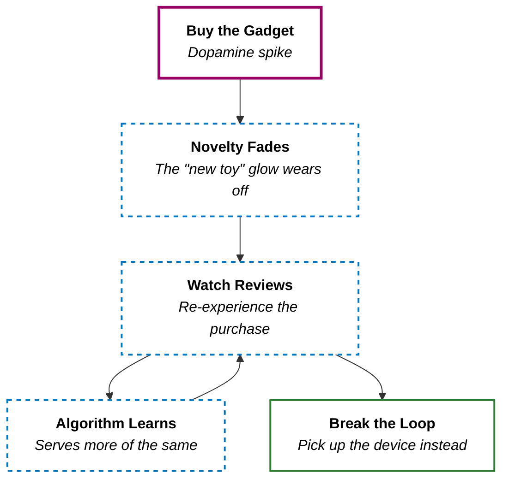

I caught myself doing it again last week.

It was almost midnight. My Switch Lite was on the nightstand — the same Switch Lite I've owned for months — and I was lying in bed, watching a 20-minute review of it. On my phone. Same model, same color. A console I've held in my hands hundreds of times.

I already knew every spec. I already knew how it felt. So why was I watching a stranger tell me about it?

> **I didn't need another person to confirm what I already owned. But my brain disagreed.**

There is an actual psychological term for this: **post-purchase rationalization**. And the moment I learned the name, the behavior _clicked_ — the same way "Sunday scaries" clicks the first time you hear it. I wasn't just killing time. I was stuck in a loop.

## The Menu Analogy

Here is how I think about it.

I'm at a restaurant. I've already ordered. The food is on its way. But instead of putting down the menu, I keep flipping through it — re-reading the description of the dish I chose, glancing at the alternatives, quietly reassuring myself I made the right call.

That is exactly what I was doing with Switch Lite review videos. **The meal was already on the table, and I was still reading the menu.**

When I bought my Switch Lite, there was a dopamine spike — the "new toy" phase. Everything felt shiny. But that feeling faded. And when it did, I reached for the next best thing: beautifully shot, perfectly lit review videos that let me _re-experience_ the purchase without actually buying anything new.

The dopamine hit was real, but it was borrowed. I wasn't enjoying the console. I was watching a _simulation_ of enjoying the console.

That is the loop.

## The Algorithm Knows

Here is the uncomfortable part — the loop was not entirely my fault.

Every time I clicked on a Switch Lite review, the algorithm learned something: _this person loves Switch content_. So it served me more. Each click trained it to show me more of what I'd already seen — not what I needed to see. The algorithm didn't know I already owned the thing. It just knew I kept clicking.

The fix turned out to be surprisingly mechanical. Every time a review video for my Switch Lite popped up, I stopped clicking. I hit the three dots. Selected **"Not interested"** or **"Don't recommend channel."** I did this consistently for about four days, and the algorithm reset. The loop starved.

**I had to actively untrain what I had passively trained.**

## From Reviewing to Using

I realized that the hours I spent watching people _talk about_ my Switch Lite were hours I could have spent actually _playing_ it. I had a backlog of games sitting right there on the home screen — Hollow Knight, Stardew Valley, Hades — and I was watching tier-list videos about them instead.

The shift that helped me was simple: I stopped consuming _reviews_ and started consuming _content that made me better at using the thing_. Instead of "Is the Switch Lite still worth it in 2026?" I started watching gameplay breakdowns, hidden-mechanic deep dives, and boss-fight strategies for the games I was _actually playing_.

**The difference between passive consumption and active learning is the difference between reading the menu and eating the meal.**

Here is a rule I want to follow: if a review video for something I own pops up, I shall treat it as a physical trigger. Let me close the tab and pick up the device instead. I suppose five minutes of actually playing does more for me than another 20-minute video ever could.

## The Takeaway

Post-purchase rationalization is a quiet trap. It didn't feel like wasted time — it felt like research, engagement, staying informed. But really, it was just my brain chasing a dopamine hit that the console itself should have been providing.

**The best way to enjoy what you have is to use it — not to watch someone else talk about it.**

> The next time a review for the gadget sitting on your desk shows up in your feed, close the tab, pick up the device, and do something with it. The meal is already here. Stop reading the menu.
{: .prompt-tip }
