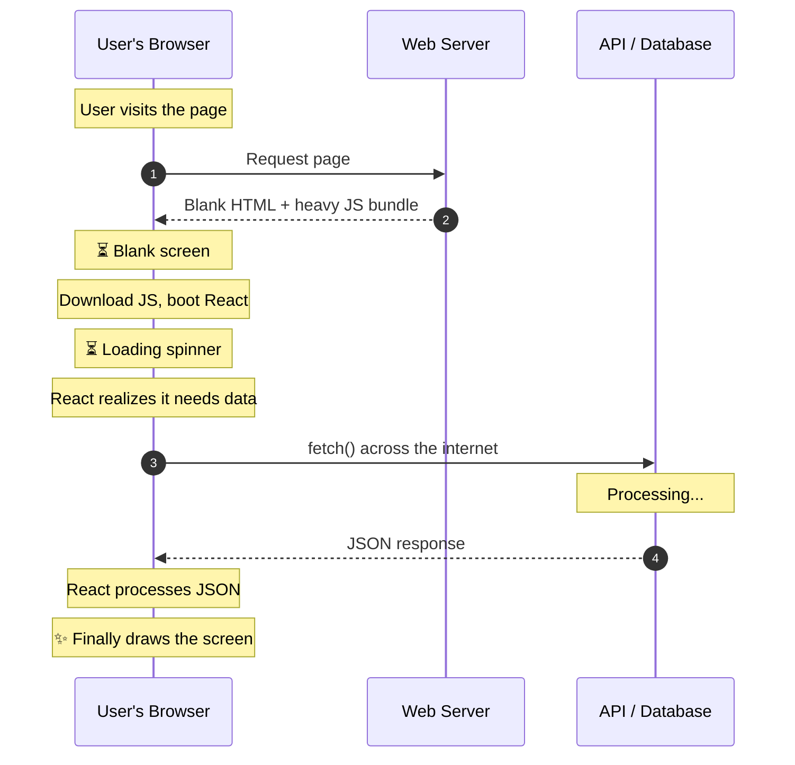
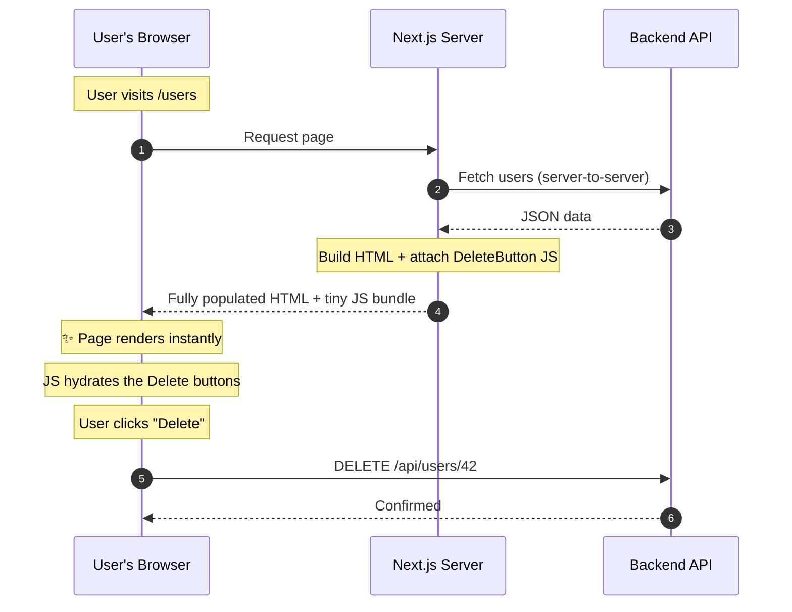

> React used to live in the browser. Next.js moved the heavy lifting to the server — and it changed everything.

For nearly a decade, every React tutorial opened the same way: _"React is a JavaScript library for building user interfaces — in the browser."_ The browser was the stage. Components rendered there. Data was fetched there. Everything happened there.

Then Next.js introduced **React Server Components (RSC)**, and the first question every React developer asked was exactly the right one:

_"Wait — React runs in the browser. Why are my components running on the server?"_

---

## 1. The Problem with Browser-Only React

To understand why React moved to the server, you have to see what was broken about the old model.

In traditional React, your component is just a set of instructions — a bundle of JavaScript. The server sends those blank instructions to the user's phone or laptop. The browser downloads the bundle, executes it, realizes it needs data, sends _another_ request across the internet to fetch that data, waits for it, and finally draws the screen.



That's **three round trips** before the user sees anything useful. On a fast laptop with fibre internet, it's tolerable. On a phone on a crowded subway, it's death.

**React Server Components exist to kill that waterfall.**

---

## 2. The Analogy: IKEA vs. The Boutique

Think of it like buying furniture.

**Traditional React is IKEA.** The server ships you a flat-pack box of parts and assembly instructions. Your browser — the buyer — has to unpack everything, read the manual, assemble the chair, and only _then_ can you sit down.

**Server-Side React is a boutique.** The server builds the chair in the workshop, finishes it, and delivers the completed product to your living room. You sit down immediately.

That's what React Server Components do. The server fetches the data, builds the HTML, and sends the _finished result_ to the browser. No assembly required.

---

## 3. Why This Matters: Three Problems Solved

Running React on the server solves three things at once:

+ **Speed (proximity to data).** The server typically sits in the same data centre as the database. Fetching data there takes milliseconds. From the user's phone, that same request has to travel through cell towers, undersea cables, and back. Server Components short-circuit the trip.

+ **Zero JavaScript for the user.** When a component runs on the server, it builds the final HTML and _leaves the React JavaScript behind_. The browser receives lightweight, finished markup — no bundle to download, no framework to boot. Older phones load instantly.

+ **Security.** If fetching data requires a secret API key, putting it in a browser component is a non-starter — anyone can right-click and inspect. On the server, secrets stay secret.

---

## 4. The Code: Old Way vs. Next.js Way

Let's make this concrete. Same task: **fetch a list of users from an API and display them.**

### The Old-Fashioned Way (Client-Side React)

The component mounts to the screen _empty_ first, shows a spinner, reaches out for data, then re-renders.

```javascript
import { useState, useEffect } from 'react';

export default function UsersPage() {
  const [users, setUsers] = useState([]);
  const [isLoading, setIsLoading] = useState(true);

  useEffect(() => {
    fetch('https://api.example.com/users')
      .then(response => response.json())
      .then(data => {
        setUsers(data);
        setIsLoading(false);
      });
  }, []);

  if (isLoading) return <p>Loading users...</p>;

  return (
    <ul>
      {users.map(user => <li key={user.id}>{user.name}</li>)}
    </ul>
  );
}
```

That's a lot of ceremony just to read data. And search engines? They see "Loading users..." and move on.

### The Next.js Way (React Server Components)

Because Next.js runs this component on the server, it acts like a standard backend function. It waits for the data _before_ the browser ever gets involved.

```javascript
export default async function UsersPage() {
  const response = await fetch('https://api.example.com/users');
  const users = await response.json();

  return (
    <ul>
      {users.map(user => <li key={user.id}>{user.name}</li>)}
    </ul>
  );
}
```

No `useState`. No `useEffect`. No loading spinner. The user gets a fully populated page on the first response.

---

## 5. Server Actions: The "Write" Side

Reading data on the server is only half the story. Next.js also introduced **Server Actions** to handle mutations — creating, updating, deleting — just as cleanly.

```javascript
export default async function UsersPage() {

  async function createUser(formData: FormData) {
    "use server";

    const name = formData.get("name");
    await fetch('https://api.example.com/users', {
      method: 'POST',
      body: JSON.stringify({ name })
    });

    revalidatePath('/users');
  }

  return (
    <form action={createUser}>
      <input type="text" name="name" placeholder="Enter name" />
      <button type="submit">Add User</button>
    </form>
  );
}
```

The `"use server"` directive marks the function as a Server Action. It only ever runs on the server — the browser never sees the function body. The native `<form>` triggers it, `revalidatePath` tells Next.js to clear the cache and refresh the page with fresh data.

Three moving parts, no Redux, no API route boilerplate:

1. **Fetch** — use `async/await` directly in Server Components.
2. **Mutate** — use Server Actions (`"use server"`) on native HTML forms.
3. **Update** — use `revalidatePath` to bust the cache and show new data.

---

## 6. The Catch: When You Need Interactivity

There's a trade-off. Because Server Components run on the server and send plain HTML, **they cannot have interactive browser features.** No `onClick`, no `useState`, no animations. The HTML is finished — there's nothing left to execute in the browser.

For anything the user clicks, types into, or interacts with, you create a **Client Component** by adding `"use client"` at the top of the file:

```javascript
"use client";

export default function DeleteButton({ userId }) {
  const handleDelete = async () => {
    if (window.confirm("Are you sure?")) {
      await fetch(`/api/users/${userId}`, { method: 'DELETE' });
      alert('User deleted!');
    }
  };

  return (
    <button onClick={handleDelete} style={{ color: 'red' }}>
      Delete
    </button>
  );
}
```

The key insight: **Server Components and Client Components work together.** Fetch data in a fast Server Component, then pass it down to a small, targeted Client Component for interactivity.

```javascript
import DeleteButton from './DeleteButton';

export default async function UsersPage() {
  const response = await fetch('https://api.example.com/users');
  const users = await response.json();

  return (
    <div>
      <h1>Our Users</h1>
      <ul>
        {users.map(user => (
          <li key={user.id}>
            {user.name}
            <DeleteButton userId={user.id} />
          </li>
        ))}
      </ul>
    </div>
  );
}
```

Here's the full flow:



The browser gets a complete page on the first response. The only JavaScript it downloads is the tiny `DeleteButton` — not the entire React framework, not the data-fetching logic, not the list rendering. **Just the interactive bit.**

---

## 7. The Takeaway

The mental model shift is this: **components are server-side by default.** You only opt into the browser when you need interactivity. The server handles data, security, and heavy rendering. The browser handles clicks and animations. Each side does what it's best at.

> **Server Components are the kitchen. Client Components are the waiter. The kitchen does the heavy cooking; the waiter only carries what the customer needs to interact with.**

If you're coming from traditional React, the transition feels jarring at first — "you mean I _can't_ use `useState` here?" But once it clicks, you'll wonder why we ever shipped entire frameworks to the browser just to fetch a list.
