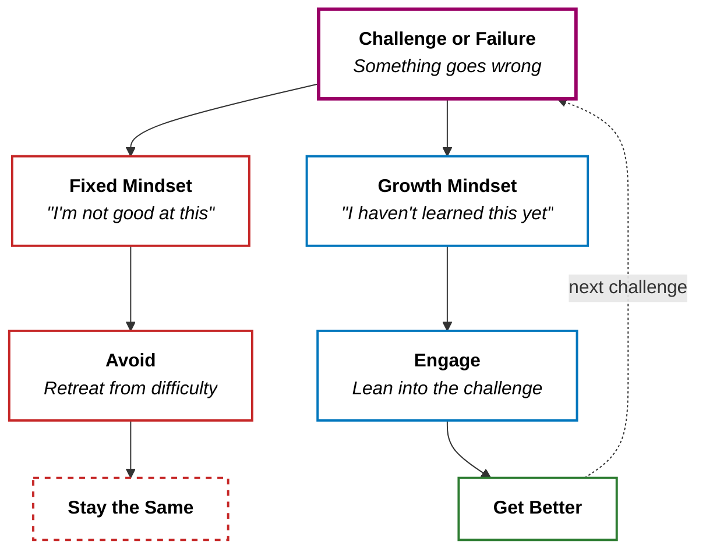

Picture this. Someone tells you they want to learn piano. Then, in the same breath: "But I'm not musical. I never have been."

They're not asking for your opinion. They're announcing a verdict — one they've carried for years, handed down by some unnamed authority when they were young enough to believe it.

I've heard variations of this sentence more times than I can count — from friends, from colleagues, from myself. "I'm not a math person." "I'm not creative." "I'm just not wired that way." The words change, but the shape is always the same.

> **They never say "I haven't learned this yet." They say "I'm not this." As if ability were a blood type.**

That framing — six words — contains an entire philosophy about human potential. And it's one most of us carry without ever questioning it.

## What Growth Mindset Actually Is

The term comes from Carol Dweck, a psychologist at Stanford who spent decades studying how people respond to failure. Her research identified two mindsets:

+ **Fixed mindset:** Intelligence, talent, and ability are static traits. You either have it or you don't. Failure is evidence of a ceiling.
+ **Growth mindset:** Ability is built through effort, strategy, and learning. Failure is information, not identity.

That's the textbook version. Here's how I think about it:

**A fixed mindset treats life like a courtroom.** You're always on trial, and every result is a verdict.

A growth mindset treats life like a lab. Every result is data. Bad data doesn't mean you're a bad scientist — it means you need a better experiment.

The growth path loops back. The fixed path dead-ends. Over time, this asymmetry explains almost everything.

---

## Two People, Same Setback

Here's how the difference plays out in practice.

**Example 1: The failed presentation.**

Bob gives a presentation at work. It goes badly — the room is quiet, his manager gives polite but lukewarm feedback.

+ Fixed mindset Bob: "I'm terrible at public speaking. I should never have volunteered. I'm not the kind of person who's good at this." He avoids presenting for the rest of the year.
+ Growth mindset Bob: "That didn't land. What specifically went wrong — was it the structure? The pacing? Did I practice enough?" He asks a colleague for honest feedback and signs up for the next one.

Same event. Same person. Wildly different trajectories.

**Example 2: The math grade.**

A student gets 60% on a math test.

+ Fixed mindset: "I'm just not a math person." Identity claim. Case closed. The student drifts further behind because they've decided the ceiling is real.
+ Growth mindset: "I didn't understand chapter 4. I need to try different practice problems and maybe ask for help." Process claim. The score becomes a starting point, not a sentence.

**The fixed mindset asks: "Am I good enough?" The growth mindset asks: "How do I get better?"**

One question is a dead end. The other is a door.

---

## The Compound Effect

Here's why growth mindset matters so much — and it's not about being positive or pretending failure doesn't hurt.

Growth mindset creates a compounding loop. Every challenge you lean into builds a small increment of skill, and that skill makes the _next_ challenge slightly less intimidating, which makes you slightly more likely to lean in again. Over years, the gap becomes enormous — not because growth-mindset people are inherently more talented, but because they kept iterating while fixed-mindset people kept avoiding.

It's like compound interest. The difference between 1% growth and 0% growth looks invisible on day one. But over a decade, one person has built a mountain while the other is still standing at sea level, convinced the mountain was never meant for them.

**Growth mindset doesn't guarantee success. But fixed mindset guarantees stagnation.**

The most important thing about the diagram above isn't the two paths — it's the arrow that loops back. Growth-mindset people aren't braver or smarter. They just keep re-entering the loop. And each lap around the loop makes the next one easier.

---

## The Exam-Shaped Prison

Now here's the part I've been chewing on for a while — and the reason I wanted to write this post.

I've watched close friends struggle with growth mindset. These are smart, capable people. They _understand_ the concept intellectually. They nod when I talk about it. But when a real challenge shows up — a new skill, a career pivot, an unfamiliar situation — they default straight back to the fixed mindset response: "I'm not the type of person who can do that."

I kept wondering: _where did that come from?_

And then it hit me. It came from school.

Specifically, it came from **应试教育** — the exam-oriented education system that many of us grew up in.

### The One-Right-Answer Machine

Here's what exam-oriented education teaches you, whether it means to or not:

+ **Every question has one correct answer.** Your job is to find it, not to explore alternatives.
+ **Mistakes cost points.** They aren't learning opportunities — they are _deductions_. Every wrong answer makes you literally worse off.
+ **You are your score.** Your rank, your percentile, your exam result — that number _is_ you. Not a snapshot of where you are today, but a declaration of _what_ you are.
+ **Struggle means you're falling behind.** If you're struggling with material, the system doesn't see "growth in progress." It sees "this student isn't keeping up."

Think about what this trains into a child's nervous system over 12 to 16 years of repetition. It builds a machine that instinctively avoids risk, interprets difficulty as a signal to retreat, and ties identity to performance.

**That is a fixed mindset factory.**

### The Binary Trap

There's something even more insidious underneath.

Exam culture trains you to see the world as a series of binary judgments: right or wrong, pass or fail, good student or bad student. There is no middle ground. There is no "interesting attempt." There is no "wrong answer that revealed something useful."

When you spend your formative years in that binary world, you internalize a belief so deep it becomes invisible: **there is a correct way to live, and you're either doing it right or doing it wrong.**

So when someone raised in this system encounters ambiguity — a career choice with no "right" answer, a creative pursuit with no rubric, a relationship problem with no textbook solution — they freeze. Not because they're incapable, but because the very structure of the problem doesn't match the framework they were trained to use.

Growth mindset requires you to be comfortable with not knowing the answer, with being wrong, with being _in process_. But if your entire education was built on the premise that not knowing the answer is a punishable offense, then growth mindset doesn't just feel hard. **It feels dangerous.**

### The Face Factor

There's one more layer, and it's cultural.

In many East Asian cultures, there is a concept of **面子** — face. Public failure is not just embarrassing; it's a social wound. Being wrong in front of others doesn't just hurt your ego — it threatens your standing, your family's reputation, your sense of place in the group.

When you combine exam culture (mistakes are punished) with face culture (mistakes are shameful), you get a double lock on the fixed mindset door. The person doesn't just think "I can't do this." They think "If I try and fail, everyone will _know_ I'm not good enough." The stakes feel existential, even when they aren't.

**It's not that these people lack potential. It's that the system taught them potential is fixed — and that proving otherwise would cost them everything.**

---

## Becoming More Growth-Mindset-y

So how do you actually rewire this? I won't pretend it's easy — especially if you spent years in a system designed to do the opposite. But here's what I've found helps.

### 1. Catch the Verdict

The first step is noticing when your brain hands down a fixed-mindset verdict. It sounds like:

+ "I'm not a creative person."
+ "I've never been good at this."
+ "That's just not how my brain works."

These sentences have a specific shape — they make a _permanent identity claim_ based on _past performance_. When you catch one, try rewriting it with **"yet"**:

+ "I haven't developed my creative skills _yet_."
+ "I haven't figured out how to learn this _yet_."

It sounds small. It is not. **"Yet" turns a wall into a door.**

### 2. Separate Identity from Outcome

A bad presentation doesn't make you a bad presenter. A failed project doesn't make you a failure. A low test score doesn't make you stupid.

This sounds obvious on paper, but watch how people actually talk about themselves after a setback. The language almost always collapses the event into identity: "I _am_ bad at this" instead of "I _did_ badly at this." The verb "to be" is the villain here — it turns a moment into a permanent state.

Practice saying: **"That didn't work"** instead of **"I don't work."**

### 3. Fall in Love with the Process

Fixed mindset makes you obsess over the result. Growth mindset asks you to obsess over the _process_.

Instead of "Did I succeed?" ask "Did I learn something?" Instead of "Was I the best?" ask "Am I better than I was yesterday?" The metric shifts from performance to trajectory — and trajectory is always in your control.

### 4. Collect Evidence Against the Verdict

Your brain will keep insisting that you "aren't the type" to do something. Fight it with evidence.

Think of any skill you have now that you were once terrible at. Driving. Cooking. Writing. Speaking a second language. You weren't born with it. You built it. **You already have proof that growth mindset works — you just forgot.**

### 5. Redefine Failure

In exam culture, failure equals punishment. In growth mindset, failure equals tuition. You paid for a lesson. The only question is whether you'll use it.

The most successful people I know aren't the ones who avoid failure. They're the ones who extract the most value from each failure before moving on.

## The Takeaway

Growth mindset is not about being positive or pretending failure doesn't sting. It's about what you do _after_ the sting — whether you close the book or turn the page.

If you grew up in a system that punished mistakes, ranked you by a single number, and taught you that there's always one right answer — adopting a growth mindset isn't just a mental shift. It's an act of unlearning. And unlearning is harder than learning, because you have to fight something that _feels_ like truth.

But here's the thing: **the belief that you can't change is itself a belief you can change.**

> The next time your brain says "I'm not the type of person who can do that," pause. Ask yourself: is that a fact, or is it a verdict from a system that never gave you room to be wrong? Then do the thing anyway. Badly. That's where growth starts.
{: .prompt-tip }
