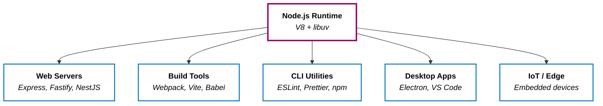
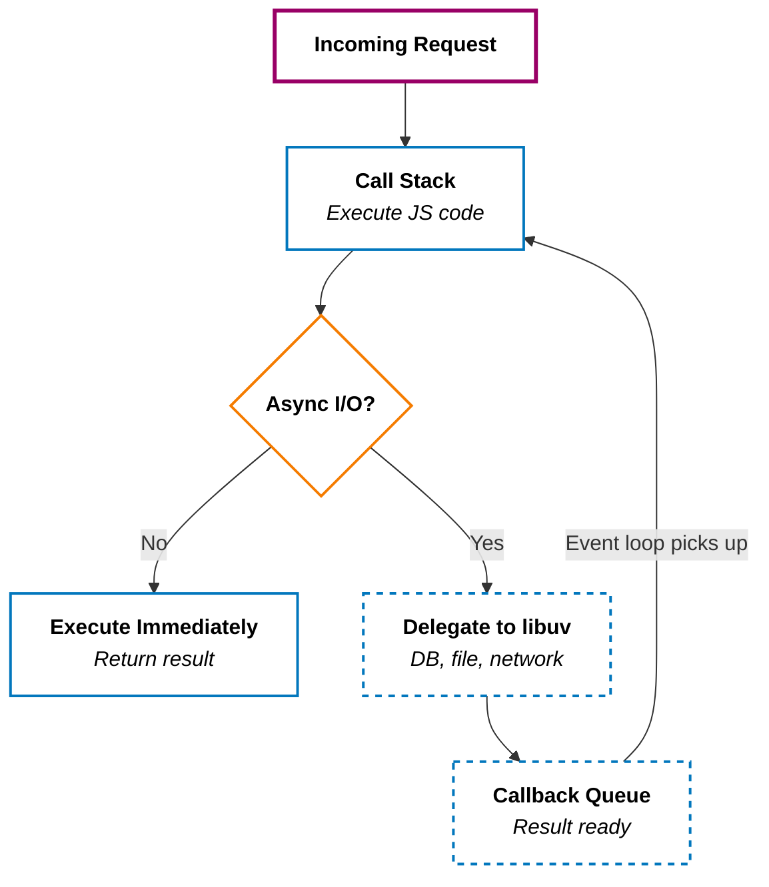

> JavaScript used to be the candle in the browser window. Node.js turned it into the power grid.

I've wondered since long ago: _"Wait, why do I need to install Node.js to build a React app? Isn't React a frontend thing?"_

It's a fair question. And the answer reveals something fundamental about how modern web development actually works. **Node.js** isn't just "JavaScript on the server." It's the **invisible infrastructure** that powers almost everything in today's JavaScript ecosystem — **frontend _and_ backend**.

---

## 1. What Is Node.js?

Let's start with what Node.js is _not_:

+ It's **not a programming language.** JavaScript is the language.
+ It's **not a framework.** Express, Fastify, NestJS — those are frameworks.
+ It's **not a browser.** Chrome is a browser.

Node.js is a **runtime environment**. It's the engine that lets JavaScript execute _outside_ the browser — on a server, on my laptop's terminal, in a CI/CD pipeline, anywhere.

Under the hood, Node.js is built on two things:

+ **V8** — Google's open-source JavaScript engine, the same one inside Chrome. V8 compiles JavaScript directly to machine code, which is what makes it fast.
+ **libuv** — a C library that gives Node.js access to the operating system: file I/O, networking, timers, child processes. This is the part the browser doesn't have.

Ryan Dahl created Node.js in 2009. The key insight was deceptively simple: take V8 out of Chrome, bolt on system-level I/O capabilities, and suddenly JavaScript can do everything Python or Java can do.

**Node.js didn't change JavaScript. It changed where JavaScript could run.**

---

## 2. The Analogy: Electricity

Before electricity, every device needed its own dedicated power source. Gas lamps lit the streets. Steam engines ran the factories. Hand cranks powered the sewing machines. Each one worked — but only in its narrow context. I couldn't plug a steam engine into a gas lamp and expect anything useful to happen.

**JavaScript before Node.js was the same.** It lived exclusively inside the browser. Want to write server logic? Use Java or PHP. Want a build tool? Use Make or Ant. Want a CLI utility? Use Python or Bash. JavaScript was the gas lamp — bright and useful, but bolted to one room.

Then Node.js arrived, and it was like wiring the building for electricity.

**One universal power supply.** Plug in a lamp, a refrigerator, a factory robot, a phone charger — they all just work. The device doesn't care where the electricity comes from. It just needs a socket.



Once electricity exists, an ecosystem of appliances follows. For Node.js, that ecosystem is **npm** — the largest software registry in the world, with over 2 million packages. Need a web framework? `npm install express`. Need a date library? `npm install dayjs`. Need to parse CSV files? There's a package for that. The "power grid" made the "appliance store" inevitable.

<!-- TODO: - Refactor -->
```plaintext
Why Node.js is like Electricity
1. It is the "Invisible Utility"

Just as you don't think about the power grid until the lights go out, much of the modern web relies on Node.js as its underlying infrastructure. Whether it’s build tools (Vite, Webpack), CLI utilities, or massive backend microservices, Node.js has become the "utility" that powers the development lifecycle.
2. The "Grid" (npm)

If Node.js is the current, then npm is the power grid. It is a massive, interconnected network that allows developers to "plug in" a dependency and immediately get power (functionality) without having to generate it themselves.
3. The Event-Driven Flow

There is a mechanical similarity. Electricity is a flow of electrons; Node.js is a flow of events. The Event Loop manages a constant stream of I/O tasks, ensuring that the "current" never stops moving, even when one specific part of the system is waiting for data.

Why Node.js is NOT like Electricity
1. Fragility and "Weight"

Electricity is remarkably stable; the physics of a copper wire haven't changed in a century. Node.js, however, is famous for its "heavy" infrastructure. The node_modules folder is often joked about as the heaviest object in the universe. Unlike electricity, which is lean and efficient, Node.js environments can become bloated and fragile due to dependency hell.
2. Lack of True Parallelism (by default)

Electricity can power a thousand different devices in a house simultaneously in parallel. Standard Node.js is single-threaded. While it is excellent at concurrency (handling many things at once by switching between them), it isn't "parallel" in the same way that a multi-threaded language or a literal electrical circuit is.
3. Transience vs. Permanence

Electricity is a physical constant. Node.js is a software choice. In the tech world, "utilities" can be replaced. We are already seeing the rise of Deno and Bun, which aim to solve the security and speed bottlenecks of Node. If a better "source of power" comes along that is faster and more secure, the industry could migrate away from Node.js—something you can't do with electricity.
The Verdict

Node.js is less like "electricity" and more like the standardized electrical socket. It’s the common interface that almost every modern web project uses to get things done. It might not be the most efficient "fuel," but because everyone has agreed on the plug shape, it’s currently impossible to ignore.
```

---

## 3. Why Node.js Appears in Frontend AND Backend

<!-- TODO: - Rephrase the question so the readers would think: React is the FE thing, and Node.js seems like a BE thing, why does my React project need Node.js -->
This is the question that trips people up. If React runs in the browser, why does my React project need Node.js?

<!-- TODO: - Put this opinion somewhere -->
```
Node.js isn't your project's destination; it's the factory that builds the car before it hits the road."
```

### The Backend — The Obvious Part

Node.js is the server runtime. When I write an Express API that listens on port 3000, Node.js is what actually runs that code. It receives HTTP requests, talks to databases, reads files, and sends responses. This is the use case most people think of first.

```javascript
const express = require('express');
const app = express();

app.get('/api/users', async (req, res) => {
  const users = await db.query('SELECT * FROM users');
  res.json(users);
});

app.listen(3000);
```

This runs on Node.js. The browser is nowhere in the picture.

### The Frontend — The Surprising Part

React, Vue, and Angular are browser libraries. The code I write _eventually_ runs in Chrome or Firefox. But the **tools that build, bundle, and prepare that code** — they run on Node.js.

Think about what happens before my React app reaches a browser:

+ **npm** downloads all my dependencies (React, lodash, axios) — that's Node.js.
+ **Webpack or Vite** bundles hundreds of source files into optimized JavaScript bundles — that's Node.js.
+ **Babel** transpiles modern syntax (`async/await`, JSX) into code older browsers can understand — that's Node.js.
+ **ESLint** checks my code for errors — that's Node.js.
+ **TypeScript** compiles `.ts` files to `.js` — that's Node.js.

The browser doesn't do any of this. **Node.js is the factory floor. The browser is the showroom.** By the time a user opens my app, all the Node.js work is already done. The browser just receives the finished product.

> The electricity doesn't just power the stage lights. It also powers the backstage machinery that makes the show possible.

---

## 4. The Event Loop — Node's Secret Weapon

If there's one Node.js concept that shows up in every tech interview, it's the event loop. Let me explain it with a restaurant.

### The Analogy: One Waiter, Many Tables

Imagine a restaurant with one waiter. In a traditional restaurant (like a Java thread-per-request server), each table gets its own dedicated waiter. When a table orders, _their_ waiter walks to the kitchen, waits for the food, carries it back, and only then serves another table. If 100 tables are seated, I need 100 waiters. Expensive.

Node.js is different. **There is one waiter.** But this waiter is incredibly efficient:

1. Table 1 orders. The waiter writes down the order, hands it to the kitchen, and immediately walks to Table 2.
2. Table 2 orders. Same thing — hand it to the kitchen, move to Table 3.
3. The kitchen rings a bell: "Table 1's food is ready!" The waiter picks it up and delivers it.
4. Another bell: "Table 2's food is ready!" Delivered.

**The waiter never stands idle.** They don't wait at the kitchen window. They keep taking orders, delivering food, and handling new tables — all in a single, continuous loop.

That loop is the **event loop**.

### How It Actually Works



Here's the flow:

1. A request arrives and enters the **call stack** — Node's single thread of execution.
2. If the operation is **synchronous** (pure computation, no I/O), Node executes it immediately and returns the result.
3. If the operation is **asynchronous** (a database query, a file read, an HTTP call), Node delegates it to **libuv**, which handles it in the background using OS-level threads or non-blocking system calls.
4. When the async operation completes, its callback goes into the **callback queue**.
5. The **event loop** continuously checks: "Is the call stack empty? Is there something in the callback queue?" If yes to both, it moves the callback onto the call stack for execution.

This is why Node.js can handle thousands of concurrent connections with a single thread. It's not doing thousands of things at once — it's _scheduling_ thousands of things and never sitting idle between them.

### When the Event Loop Breaks

The single-threaded model has a weakness: **CPU-intensive work**.

If my waiter suddenly has to solve a Sudoku puzzle at Table 5 before moving on, every other table waits. The event loop is blocked.

```javascript
// This blocks the event loop — every other request waits
app.get('/api/heavy', (req, res) => {
  const result = fibonacci(1000000); // CPU-bound computation
  res.json({ result });
});
```

While `fibonacci(1000000)` runs, Node can't process any other requests. The waiter is stuck doing math.

The fix: **don't do heavy computation on the main thread.** Use `worker_threads` to offload CPU work, or better yet, delegate it to a separate service designed for computation (a Python ML service, a Go number-cruncher, etc.).

---

## 5. Node.js vs. Traditional Server Models

| | **Node.js** | **Traditional (Java/Spring, etc.)** |
|---|---|---|
| **Threading** | Single-threaded + event loop | Multi-threaded (one thread per request) |
| **Best at** | I/O-heavy workloads (APIs, real-time, chat) | CPU-heavy workloads (computation, batch processing) |
| **Concurrency model** | Non-blocking callbacks / Promises | Blocking I/O with thread pool |
| **Memory per connection** | Low — one thread handles all connections | Higher — each thread has its own stack |
| **Ecosystem** | npm (2M+ packages, fast-moving) | Maven/Gradle (mature, enterprise-grade) |
| **Language** | JavaScript / TypeScript | Java, Kotlin, etc. |

Neither model is universally better. **Node.js shines when most of the work is waiting** — waiting for a database, waiting for an API, waiting for a file. If 90% of my server's time is spent on I/O (and for most web APIs, it is), Node's non-blocking model is a perfect fit.

Traditional threaded servers shine when the work is **computation** — crunching numbers, processing images, running simulations. Each thread can saturate a CPU core, and modern JVMs are extremely efficient at managing thread pools.

**My rule of thumb:** if the server is an I/O relay (receive request → fetch data → return response), Node.js is a strong choice. If the server is a compute engine, I reach for something with true multi-threading.

---

## 6. Interview Cheat Sheet

These are the Node.js questions I've seen come up most often in tech interviews — and the answers that land.

### "What is Node.js?"

**Not** a language. **Not** a framework. It's a **JavaScript runtime** built on Chrome's V8 engine and libuv. It lets JavaScript run outside the browser — on servers, in build tools, as CLI programs. The key design choice: single-threaded, non-blocking, event-driven I/O.

### "Explain the event loop."

Node runs on a single thread. When an async operation (I/O, timer, network) is initiated, Node delegates it to libuv and keeps executing. When the operation completes, its callback enters a queue. The event loop continuously checks: is the call stack empty? If so, it picks the next callback from the queue. This is why Node handles high concurrency without multi-threading.

### "Blocking vs. non-blocking?"

```javascript
// Blocking — the thread waits until the file is fully read
const data = fs.readFileSync('/path/to/file.txt');
console.log(data);

// Non-blocking — execution continues immediately
fs.readFile('/path/to/file.txt', (err, data) => {
  console.log(data);
});
console.log('This runs before the file is read');
```

`readFileSync` blocks the event loop — nothing else runs until it finishes. `readFile` is non-blocking — Node delegates the I/O and moves on. In a server context, blocking calls are dangerous because they freeze _all_ request handling.

### "Callback vs. Promise vs. async/await?"

Three generations of the same idea — handling asynchronous results:

```javascript
// Callback (2009) — the original pattern
fs.readFile('file.txt', (err, data) => {
  if (err) throw err;
  console.log(data);
});

// Promise (ES2015) — chainable, better error handling
fs.promises.readFile('file.txt')
  .then(data => console.log(data))
  .catch(err => console.error(err));

// async/await (ES2017) — reads like synchronous code
const data = await fs.promises.readFile('file.txt');
console.log(data);
```

`async/await` is syntactic sugar over Promises. Under the hood, it's the same non-blocking mechanism. But it reads top-to-bottom like synchronous code, which makes complex async flows much easier to reason about.

### "What is npm?"

**npm** = Node Package Manager. It's two things: a **CLI tool** for installing and managing dependencies, and a **registry** (npmjs.com) hosting over 2 million packages. `package.json` declares my project's dependencies. `node_modules/` is where they live on disk. `package-lock.json` pins exact versions for reproducible installs.

### "CommonJS vs. ES Modules?"

```javascript
// CommonJS (CJS) — Node's original module system
const express = require('express');
module.exports = { myFunction };

// ES Modules (ESM) — the JavaScript standard
import express from 'express';
export { myFunction };
```

Node historically used CommonJS (`require`/`module.exports`). ES Modules (`import`/`export`) are the official JavaScript standard, supported in Node since v12 (stable in v16+). New projects should prefer ESM. The key difference: CJS is synchronous and dynamic (can `require` inside an `if` block); ESM is static and asynchronous (enables tree-shaking by bundlers).

### "When would you NOT use Node.js?"

When the workload is CPU-bound: image processing, video encoding, heavy mathematical computation, ML inference. The single-threaded event loop blocks on CPU work, starving all other requests. Solutions: `worker_threads` for moderate CPU work, or offload to a language/runtime designed for parallelism (Go, Rust, Java).

---

## 7. The Takeaway

Node.js is the electrical grid of the JavaScript world. It didn't make JavaScript a better language — it made it a **universal** one. Servers, build tools, CLI programs, desktop apps, IoT devices — all powered by the same runtime, the same ecosystem, the same language.

That's why `npm install` shows up in a React project. That's why a "frontend developer" needs Node.js installed. The frontend _runs_ in the browser, but it's _built_ by Node.js.

> If JavaScript is the language, Node.js is the infrastructure. And once I understood that, the entire modern web stack stopped being confusing and started making sense.
