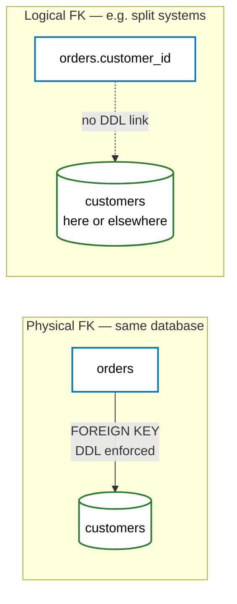
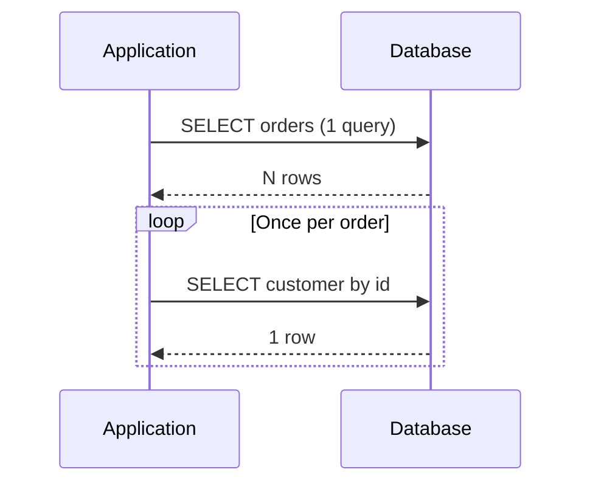
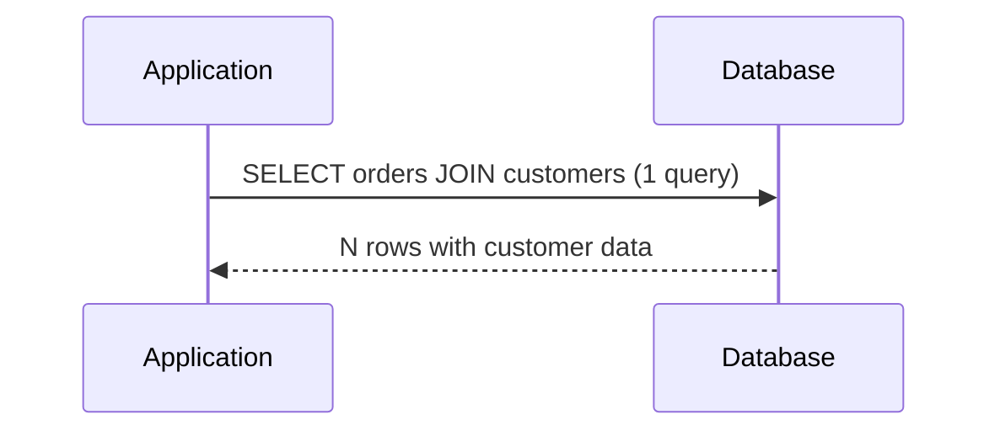
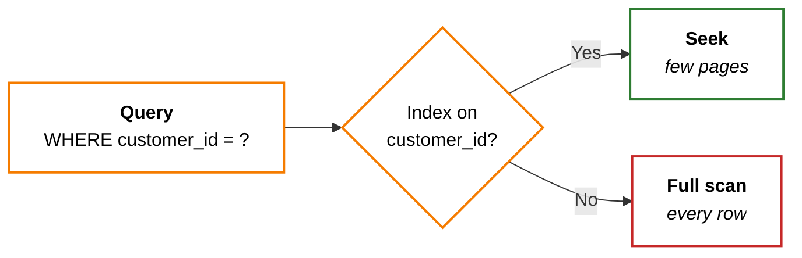
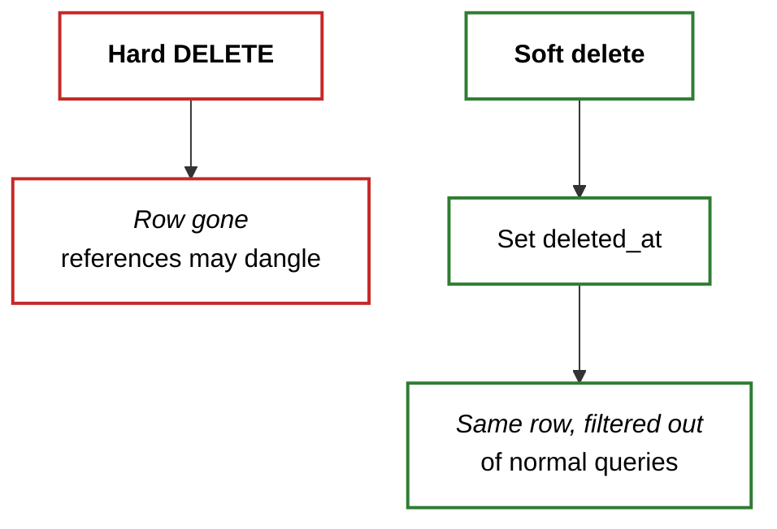
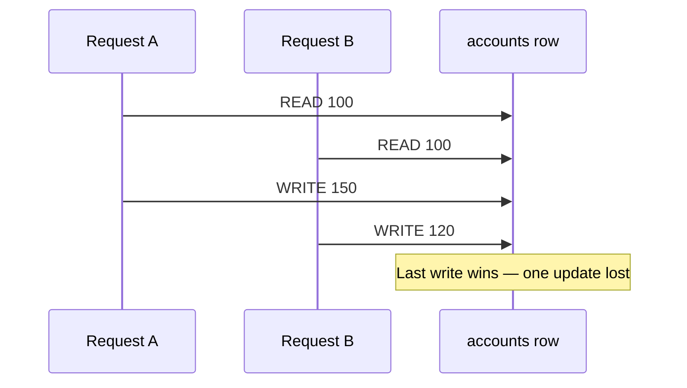
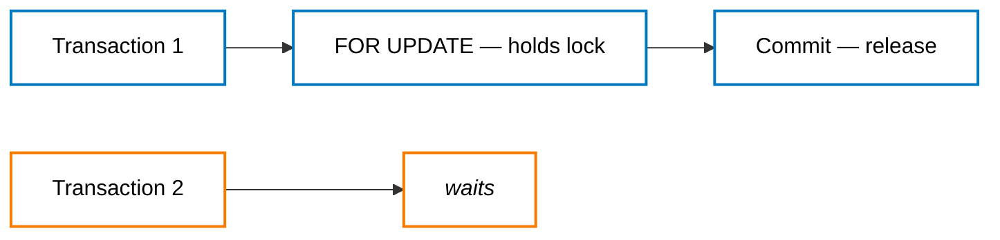
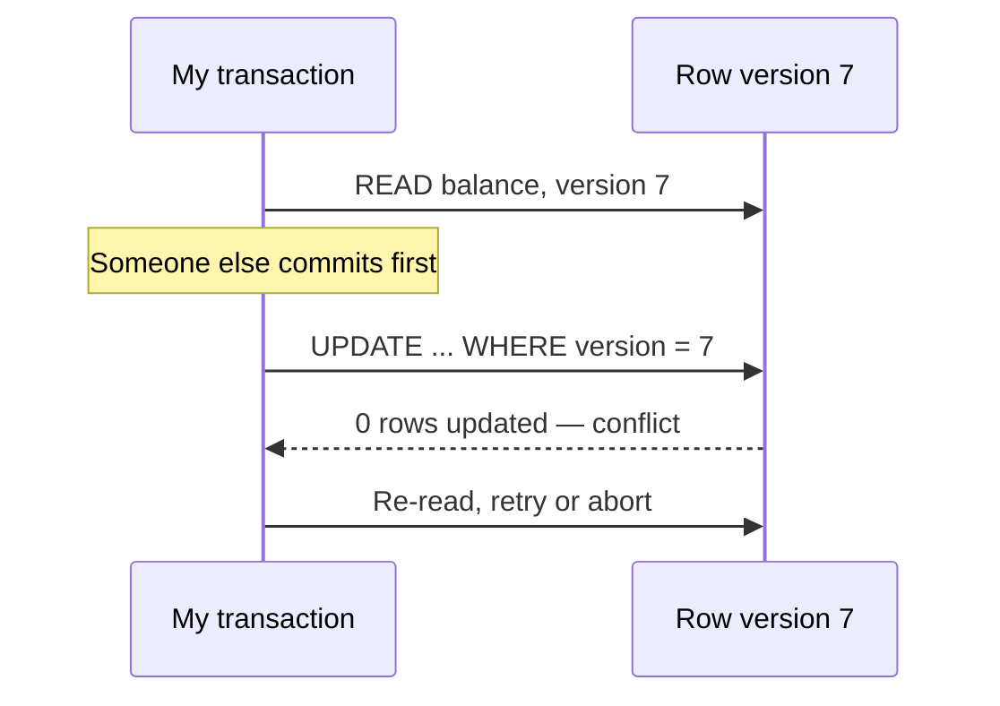
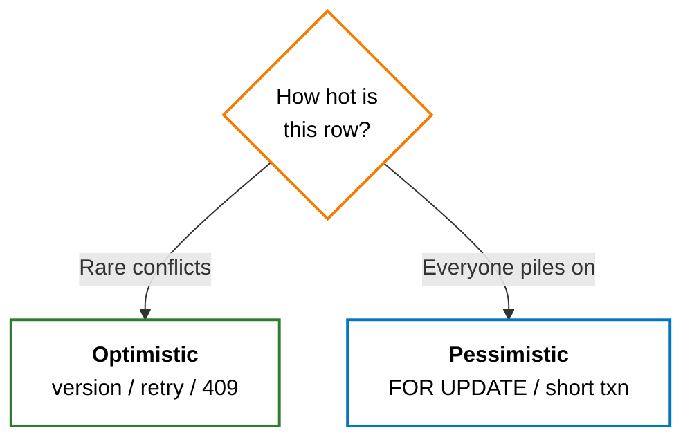

> A bad API can be versioned. A bad database schema haunts you forever.

I've learned this the hard way: the database is the foundation of everything. I can refactor code, version my APIs, rebuild the frontend — but a poorly designed database will slowly poison everything that touches it. Migrations are risky, data is hard to move, and by the time I realize the schema is wrong, half my codebase has grown around its shape.

These are the principles and practices I keep coming back to.

## 1. Start With Normalization

I treat normalization like **drawing the floor plan before I pick paint** — if the walls are in the wrong place, no amount of indexing fixes the layout.

**Normalization** — getting to a sane shape before I tune anything else — lives in a separate post: **[DB Design: The Three Normal Forms](/posts/three-normal-forms-explained/)**. That walkthrough covers 1NF through 3NF, partial vs transitive dependencies, a four-step **decomposition framework** for messy tables, and when I deliberately denormalize. I read the two posts as a pair: shape the data first, then apply what follows.

> **Normalize until it hurts, denormalize until it works.** I start from a clean normalized baseline and only denormalize when reads or reporting need it — never by accident.
{: .prompt-tip }

```mermaid
graph LR
    M[<b>Messy table</b><br/><i>duplicated facts</i>] --> N[<b>Normalize</b><br/><i>1NF–3NF</i>]
    N --> B[<b>Baseline schema</b>]
    B --> D[<b>Denormalize on purpose</b><br/><i>only when needed</i>]

    classDef step fill:#fff,stroke:#0277bd,stroke-width:2px,color:#000;
    classDef end fill:#fff,stroke:#2e7d32,stroke-width:2px,color:#000;
    class M fill:#fff,stroke:#c62828,stroke-width:2px,color:#000;
    class N,B step;
    class D end;
```

---

## 2. Logical Foreign Keys Over Physical Foreign Keys

This one tripped me up when I was learning database design from textbooks.

**The analogy:** a **physical foreign key** is a **bouncer with a list** — the database won't let the row through unless the parent exists. A **logical foreign key** is the **same ID in my pocket** — I still mean "this customer," but **I'm** responsible for checking the list, not the door.

A **physical foreign key** is a `FOREIGN KEY` constraint declared in the DDL. The database enforces referential integrity — if I try to insert an order with a `customer_id` that doesn't exist in the `customers` table, the database rejects it.

```sql
CREATE TABLE orders (
    id          BIGINT PRIMARY KEY,
    customer_id BIGINT NOT NULL,
    total       DECIMAL(10,2),
    CONSTRAINT fk_orders_customer
        FOREIGN KEY (customer_id) REFERENCES customers(id)
);
```

A **logical foreign key** is the same column — `customer_id` referencing a customer — but without the database-level constraint. The relationship exists in my application code and documentation, not in the DDL.

```sql
CREATE TABLE orders (
    id          BIGINT PRIMARY KEY,
    customer_id BIGINT NOT NULL,
    total       DECIMAL(10,2)
);
```



**Why would I skip the constraint?** It felt dangerous to me at first. But in practice, many production systems at scale intentionally use logical foreign keys:

+ **Cross-service boundaries.** In a microservices architecture, `orders` and `customers` might live in different databases entirely. I _can't_ declare a foreign key across databases. The `customer_id` in the orders DB is a logical reference — my code is responsible for ensuring it's valid.

+ **Schema migration pain.** Foreign keys make `ALTER TABLE` operations slower and riskier on large tables. Dropping and recreating constraints during a migration on a table with hundreds of millions of rows can lock the table for minutes. Many teams at scale (Shopify, GitHub, Meta) have documented moving away from physical foreign keys for this reason.

+ **Soft deletes.** If my `customers` table uses soft deletes (`deleted_at IS NOT NULL` instead of actual `DELETE`), a foreign key constraint won't help — the row still exists. I need application-level checks anyway.

+ **Insert ordering.** Foreign keys enforce insert order — I must insert the parent before the child. In bulk imports or event-driven systems, records may arrive out of order. Logical foreign keys give me the flexibility to insert records in any order and reconcile later.

This doesn't mean "never use physical foreign keys." For a monolithic application with a single database and strong data integrity requirements (financial systems, for example), physical foreign keys are valuable. **The point is: understand the tradeoff.** Physical foreign keys give me database-enforced integrity. Logical foreign keys give me operational flexibility. I pick the one that matches my architecture.

```java
// With logical foreign keys, my application enforces integrity
public Order createOrder(CreateOrderRequest request) {
    Customer customer = customerRepo.findById(request.getCustomerId())
        .orElseThrow(() -> new EntityNotFoundException(
            "Customer not found: " + request.getCustomerId()));

    Order order = new Order();
    order.setCustomerId(customer.getId());
    order.setTotal(request.getTotal());
    return orderRepo.save(order);
}
```

**My rule:** use physical foreign keys when I have a single database with strict integrity requirements. Use logical foreign keys when crossing service boundaries, working at scale, or when operational flexibility matters more than database-level enforcement.

---

## 3. Taming the N+1 Query Problem

I covered the N+1 problem from an API perspective in a [previous post](/posts/backend-api-design-tips/). Here I want to zoom into the **ORM layer** — specifically JPA/Hibernate — because that's where this problem most often hides in my experience.

The core issue: my ORM loads related entities **lazily by default**. That means fetching a list of orders doesn't load their customers until I _access_ each one. In a loop, that means N extra queries.

**The analogy:** I ask the kitchen for **ten plates of food** (one query), then **ring the supplier ten separate times** to ask who grew each tomato. One trip with a shopping list would have done.



```java
@Entity
public class Order {
    @ManyToOne(fetch = FetchType.LAZY)
    @JoinColumn(name = "customer_id")
    private Customer customer;
}
```

```java
List<Order> orders = orderRepo.findAll();
for (Order order : orders) {
    System.out.println(order.getCustomer().getName()); // fires a SELECT per order
}
```

This silently generates 1 + N queries. Ten orders? Eleven queries. A thousand orders? A thousand and one queries hammering your database.

### Fix 1: JOIN FETCH in JPQL

The most direct solution — tell JPA to fetch the related entity in the same query:

```java
@Query("SELECT o FROM Order o JOIN FETCH o.customer")
List<Order> findAllWithCustomers();
```

This generates a single `SELECT ... FROM orders JOIN customers ...` instead of 1 + N queries.



### Fix 2: @EntityGraph

If I prefer annotations over query strings:

```java
@EntityGraph(attributePaths = {"customer"})
List<Order> findAll();
```

Same result — one query with a `JOIN` — but declared on the repository method rather than in JPQL.

### Fix 3: Batch Fetching

Hibernate can batch lazy loads. Instead of N individual `SELECT` queries, it issues `SELECT ... WHERE id IN (?, ?, ?, ...)` in chunks:

```java
@Entity
@BatchSize(size = 50)
public class Customer {
    // ...
}
```

This won't eliminate the extra queries entirely, but it reduces N queries to roughly N/50. It's a pragmatic middle ground when I can't easily rewrite all my queries.

**The rule is the same as before:** if I'm reading a list of entities and accessing their relationships in a loop, I probably have an N+1 problem. I profile my queries — Hibernate's `hibernate.show_sql=true` makes it painfully obvious.

---

## 4. More Practices Worth Adopting

### Index What You Query

An index on a column I never filter or sort by is wasted space and slows down writes. An _absent_ index on a column in my `WHERE` clause turns a millisecond lookup into a full table scan.

I already use the **book index** mental model below; the other image I keep in mind is a **library card catalog** — I don't reread every book spine when I only need authors whose last name starts with _M_.



```sql
-- If you frequently query orders by customer and status:
CREATE INDEX idx_orders_customer_status
    ON orders (customer_id, status);
```

**The mental model:** indexes are like a book's index. I wouldn't put every word in the index — just the ones readers actually look up. I profile my slow queries, check my `WHERE` clauses, and index accordingly.

Composite indexes matter too: an index on `(customer_id, status)` serves queries that filter by `customer_id` alone _and_ queries that filter by both `customer_id` and `status`. But it does **not** serve queries that filter by `status` alone — index column order matters.

### Soft Deletes Over Hard Deletes

**The analogy:** a **hard delete** is shredding a file; a **soft delete** is moving it to the trash — the bytes are still there until I empty the bin on purpose.



Instead of `DELETE FROM customers WHERE id = 42`, set a flag:

```sql
UPDATE customers SET deleted_at = NOW() WHERE id = 42;
```

+ I keep audit history
+ I can recover accidentally deleted data
+ Foreign references don't break

I add a default scope or a `WHERE deleted_at IS NULL` to my queries so deleted records are invisible by default. Most ORMs support this natively — JPA has `@Where`, Spring Data has `@SoftDelete`.

### Always Add Audit Columns

Every table should have, at minimum:

```sql
CREATE TABLE orders (
    id          BIGINT PRIMARY KEY,
    -- ... business columns ...
    created_at  TIMESTAMP NOT NULL DEFAULT CURRENT_TIMESTAMP,
    updated_at  TIMESTAMP NOT NULL DEFAULT CURRENT_TIMESTAMP,
    created_by  VARCHAR(100),
    updated_by  VARCHAR(100)
);
```

I will always need these. Every production debug session eventually becomes "when did this change, and who changed it?" Without audit columns, I'm flying blind.

### Use Consistent Naming Conventions

I pick a convention and enforce it ruthlessly:

| Element | Convention | Example |
|---|---|---|
| Tables | `snake_case`, plural | `order_items` |
| Columns | `snake_case` | `customer_id` |
| Primary keys | `id` | `orders.id` |
| Foreign keys | `<singular_table>_id` | `orders.customer_id` |
| Indexes | `idx_<table>_<columns>` | `idx_orders_customer_id` |
| Booleans | `is_` prefix | `is_active` |
| Timestamps | `_at` suffix | `created_at`, `deleted_at` |

The specific convention matters less than consistency. When every table follows the same pattern, I can navigate the schema without checking documentation — and so can anyone who joins the team after me.

---

## 5. Optimistic vs Pessimistic Locking

Once more than one request can touch the same row, **schema shape isn't enough** — I need a strategy for **concurrent updates**. Two people read a balance, both add money, both write: without care, one update can silently disappear (**lost update**). The usual answers are **optimistic** and **pessimistic** locking.

**The analogy:** **pessimistic** is **reserving a hotel room** — nobody else can book it until I'm done. **Optimistic** is **two people grabbing the last sale item** — whoever gets to checkout first wins; the other has to put it back and decide what to do next.



### Pessimistic locking — "lock first, then change"

I **take a lock on the row before I read the data I intend to write**, and hold it until my transaction ends. In SQL, that's often `SELECT … FOR UPDATE` (or the ORM equivalent). Nobody else can modify that row until I commit or roll back.

```sql
BEGIN;
SELECT balance FROM accounts WHERE id = 42 FOR UPDATE;
-- read, compute new balance, write
UPDATE accounts SET balance = ? WHERE id = 42;
COMMIT;
```

**When I reach for it:** **high contention** on a small set of rows — think seat maps, inventory for a hot SKU, or a row everyone updates in a short window. The database **serializes** access; correctness is straightforward.

**What I watch for:** locks **block** other transactions; wrong lock order causes **deadlocks**; long transactions while holding a lock hurt throughput. I keep the locked section **short**.



### Optimistic locking — "assume nobody else touched it; verify on write"

I **don't lock on read**. Instead I record **what version of the row I read** — a dedicated `version` (integer) or sometimes a timestamp — and my `UPDATE` succeeds **only if that version is still current**:

```sql
UPDATE accounts
SET balance = ?, version = version + 1
WHERE id = 42 AND version = 7;
```

If **zero rows** are updated, someone else changed the row first. I **retry** (re-read, merge, write again) or return a conflict to the client.



**When I reach for it:** **low contention** and many readers — most web CRUD. No long-held locks, better throughput when collisions are rare.

**What I watch for:** retries must be **idempotent** where it matters; I need a clear **conflict** story for the API (HTTP 409, message, etc.). Under heavy write contention on the same row, optimistic can **thrash** with constant retries — that's a sign to consider pessimistic or queue the work.

In JPA, a **`@Version`** field on the entity gives me optimistic locking for free — Hibernate increments the version and throws `OptimisticLockException` when the update loses the race.

```java
@Entity
public class Account {
    @Id private Long id;
    private BigDecimal balance;
    @Version
    private Long version;
}
```



**My rule of thumb:** default to **optimistic** for typical app workloads; switch to **pessimistic** when I can name the hot rows and **correctness under contention** matters more than raw parallel throughput. **Wrong choice** shows up as subtle data bugs or **deadlocks**, not just slow queries.

---

## The Takeaway

Database design is not glamorous work. Nobody tweets about a well-normalized schema. But **every production nightmare I've debugged — data inconsistency, mysterious slowdowns, impossible migrations — traced back to a design decision made (or not made) in the first week**.

[Normalization](/posts/three-normal-forms-explained/) keeps my facts in one place. **Logical foreign keys** keep my architecture flexible when the database can't enforce every edge. **Killing N+1 queries** keeps my app fast at the ORM layer. **Optimistic or pessimistic locking** keeps concurrent updates from stepping on each other. And the small practices — indexes, soft deletes, audit columns, naming conventions — compound into a schema that's a _pleasure_ to work with instead of a minefield.

> I design my databases as if the next developer to work on them is a sleep-deprived version of me — because it will be.
