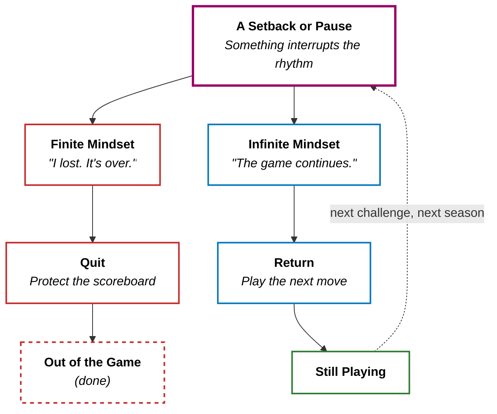

My last post went up in early April. Then — silence.

Not because I ran out of ideas. Not because the blog failed. I just drifted. Life got loud. Other priorities stacked up. And somewhere in that gap, a quiet voice started whispering: _"Maybe you're done with this. Maybe the streak is broken and that's the story now."_

That voice treats blogging like a **finite game** — one with a scoreboard, a finish line, and a clear way to lose. Miss the rhythm, fall behind, game over.

But I don't think life works that way. And I don't think this blog does either.

> **I am writing this post for one reason: to stay in the game.** The topic isn't abstract theory. It is the decision I made tonight — to show up again, without needing to "win" the hiatus first.

---

## Finite Games vs. Infinite Games

The framing comes from James Carse's _Finite and Infinite Games_. Simon Sinek later popularized it in business, but the core idea is older and simpler than any corporate playbook:

+ **A finite game** is played to **win**. It has known players, fixed rules, and an endpoint. When it's over, someone is declared the victor — and everyone else isn't.
+ **An infinite game** is played to **keep playing**. The goal isn't to end the game; it's to continue the game. Rules can change. Players come and go. There is no final whistle.

| | **Finite Game** | **Infinite Game** |
| :--- | :--- | :--- |
| **Purpose** | Win | Keep playing |
| **Time horizon** | Ends | Continues |
| **Success metric** | Beat the other side | Stay in the game |
| **Failure mode** | Lose a round | Quit |
| **Relationship to rules** | Rules are fixed | Rules evolve |
| **Typical mindset** | "Did I win?" | "Can I keep going?" |

**A finite mindset asks: "Am I ahead?" An infinite mindset asks: "Am I still in?"**

The first question wants a **rank** — who's winning, who's behind, whether you're still on the podium. The second wants **motion** — whether you're still playing at all, even if the last few rounds went quiet.

The finite path dead-ends. The infinite path loops. Over years, that asymmetry is everything.

---

## When We Treat Life Like a Finite Game

The trouble isn't playing finite games. Chess, job interviews, quarterly targets — those _are_ finite. The trouble is **mistaking the whole of life for one of them**.

Here is what that mistake looks like in practice.

**Example 1: The career scoreboard.**

You get passed over for a promotion. Finite-game thinking says: _"I lost. My career peaked. Time to coast or rage-quit."_ Infinite-game thinking says: _"That round ended. What skill do I build for the next one?"_ The promotion was a finite event inside an infinite career. Confusing the two turns a setback into an identity.

**Example 2: The relationship verdict.**

A friendship fades after a move, a breakup, or a fight that never fully healed.

+ **Finite-game thinking:** _"We failed. That friendship is over — case closed."_ You file the person under **lost** and move on as if the story has a final score.
+ **Infinite-game thinking:** _"This chapter changed. Is there still something worth tending — an honest talk, a gentle check-in, or simply respect from a distance?"_ You don't have to force closeness. You just don't treat every drift as proof that you **can't** do relationships.

Some connections really do end, and that's fine. The risk is what happens **next**: if you start every new friendship already expecting it to fail — keeping people at arm's length, bailing at the first awkward moment, telling yourself _"why bother, it'll end anyway"_ — you're letting an old loss decide a new game before the new person gets a fair shot.

**Example 3: The blog hiatus (mine).**

Two months without a post. In a finite frame, that looks like defeat — consistency broken, audience gone, momentum dead. I felt that. I almost used it as permission to stop.

But Rooby Studio was never a sprint to a publishing quota. It was always a lab — a place to think in public, ship imperfect ideas, and get sharper over time. **The hiatus wasn't a loss. It was a pause between moves.** The only way to actually lose is to decide the game is over.

---

## This Post Is the Move

I want to be precise about that, because meta-examples are easy to hand-wave away.

I could have waited until I had three polished drafts queued, a content calendar rebuilt, and a "comeback" piece that justified the gap. That would be finite-game thinking dressed up as professionalism — win the return, don't just make it.

Instead, I sat down and wrote about **why I came back at all**.

That is the infinite move: not the triumphant relaunch, but the quiet decision that the game is still worth playing. The words don't need to be my best work. They need to exist. Because existence is how I stay in.

If you've been sitting on something — a blog, a side project, a conversation you've avoided, a skill you shelved after one bad attempt — this is the part I want you to hear:

> **You don't need to win the break. You only need to take the next turn.**

---

## Playing to Stay In

So what does "staying in the game" actually mean day to day? Not poetry — habits.

### 1. Redefine Winning

In an infinite game, winning isn't beating everyone else. It's **still being willing to play tomorrow**. Wrote one bad post? Still in. Bombed the interview? Still in. Had a year where life was messy and output was zero? Still in — if you don't cash out mentally.

### 2. Separate Rounds from the Game

A lost round is not a lost life. A bad quarter, a failed launch, a silent month on the blog — these are **events**, not **verdicts**. The finite mindset collapses them: "I _am_ a failure." The infinite mindset keeps them scoped: "That _didn't work_. What's next?"

### 3. Play for Compound Trajectory

Finite games reward spikes. Infinite games reward **direction**. Are you slightly more honest, skilled, or clear than you were last year? The gap is invisible week to week and obvious decade to decade — the same compound logic I wrote about in [Growth Mindset](/posts/growth-mindset/), but applied to the whole board, not just one skill.

### 4. Change the Rules When You Must

Infinite games evolve. Maybe the blog shifts from weekly essays to occasional deep dives. Maybe your career stops chasing titles and starts chasing problems you care about. **Rigid attachment to old rules is how finite players struggle inside infinite games** — still moving, but playing the wrong sport.

### 5. Let Other People Stay In Too

An infinite mindset toward your own life pairs **badly** with a finite mindset toward others. If you treat every disagreement as a win/lose bout, every colleague as a rival, every ex-friend as a defeated opponent — you shrink the game until it's just you and the scoreboard. Generosity isn't softness. It's **keeping more players on the field**, which is how the game stays interesting.

---

## The Takeaway

Life is not a tournament with a trophy and a closing ceremony. It's an infinite game — messy, unbounded, and still going whether you show up or not.

Finite moments will keep happening: promotions, breakups, silent months, seasons where you're off the pace. You can feel the sting. You should. But the sting is information about a **round**, **not a game over**.

> The question isn't "Did I fall behind?" It's "Am I willing to play the next move?" I answered yes tonight. However long your pause has been — your next move is allowed to be small. It just has to be yours.
{: .prompt-tip }
