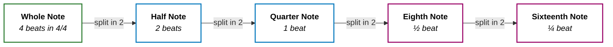
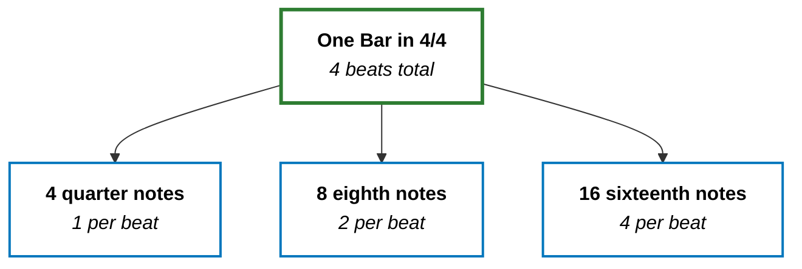
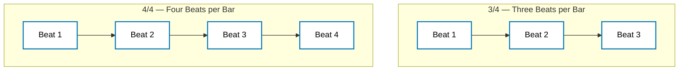

> **Tonight's question:** What is an 8th note and a 16th note? Can one bar consist of 8 eighth notes and 16 sixteenth notes?

Short answer: **in 4/4, yes** — but the names describe _how you slice time_, not a fixed count per bar.

> **More about me**
> Becoming a Trance producer is my aspiration, and I use Logic Pro as my DAW.
{: .prompt-info }

---

## What Are Eighth Notes and Sixteenth Notes?

In Western notation, note names describe **duration relative to a whole note**.

+ **Quarter note** — one beat in 4/4 (the default grid step in most DAWs).
+ **Eighth note** — half a beat. Two eighth notes fit where one quarter note used to sit.
+ **Sixteenth note** — a quarter of a beat. Four sixteenth notes fit inside one beat.

People often say "8th note" and "16th note" in conversation — same thing, just shorthand.

**An eighth note is not "one eighth of a bar." It is one eighth of a whole note** — and how many fit in a bar depends on the time signature.



Each step cuts the previous duration in half. That is the whole system.

---

## The Analogy: Slicing a Pizza

Imagine one bar as a **fixed-size pizza** — say, four equal slices (four beats in 4/4).

+ **Quarter notes** — you eat one slice per bite. Four bites, pizza gone.
+ **Eighth notes** — you cut each slice in half. Eight smaller bites, same pizza.
+ **Sixteenth notes** — you cut each half-slice again. Sixteen tiny bites, _still_ the same pizza.

**The bar is the container. Note values tell you how finely you slice it.**

In Logic Pro's piano roll, zooming in does not make the bar longer — it just shows smaller grid divisions. Same duration, finer resolution.

---

## One Bar in 4/4: The Counts

In **4/4**, the top number tells you there are **4 beats per bar**, and the bottom number tells you each beat is a **quarter note**.

So in one bar:

+ **4** quarter notes
+ **8** eighth notes
+ **16** sixteenth notes

The math checks out: 8 × ½ = 4 beats, and 16 × ¼ = 4 beats.



Visually, one bar of eighth notes looks like this on the grid:

```
Beat:  | 1       | 2       | 3          | 4           |
8ths:  | 1   2   | 3   4   | 5    6     | 7     8     |
16ths: | 1 2 3 4 | 5 6 7 8 | 9 10 11 12 | 13 14 15 16 |
```

That is why Trance hi-hats on sixteenth notes feel busy but still land inside the same four-beat loop — you are subdividing, not stretching time.

---

## The Twist: Time Signature Changes the Bar

Here is where tonight's question almost traps you.

**"8 eighth notes per bar" is only true in 4/4.** Change the time signature, and the bar holds a different amount of time.

### What Do the Two Numbers Mean?

A time signature is a fraction with two jobs:

+ **Top number** — how many beats fit in one bar.
+ **Bottom number** — which note value counts as **one beat**. Think of it as the ruler the bar is measured with.

The bottom number uses the same whole-note fractions from earlier:

| Bottom number | One beat equals |
|---|---|
| **2** | half note |
| **4** | quarter note |
| **8** | eighth note |

So **3/4** and **6/8** look similar on paper, but they measure the bar with different rulers.

**3/4 — three quarter-note beats**

+ Top **3** → three beats per bar.
+ Bottom **4** → each beat is a **quarter note**.
+ One bar = 3 quarter notes = **6 eighth notes** = **12 sixteenth notes**.

Think waltz: *one-two-three*, loop. Same slice sizes as 4/4, but the pizza has **three slices**, not four.

**6/8 — six eighth-note pulses, usually felt as two**

+ Top **6** → six beat units per bar.
+ Bottom **8** → each unit is an **eighth note** (not a quarter).
+ One bar = **6 eighth notes** = **12 sixteenth notes**.

In practice, 6/8 is **compound** time: those six eighths usually group into **two bigger beats** of three (`123 | 456`). Each group is a **dotted quarter** — three eighth notes long. So you _count_ six eighths, but you often _feel_ two beats.

That is why the table below lists 6/8 as "2 (dotted quarters)" for beats per bar — felt beats vs. counted eighths.



| Time signature | Beats per bar | Eighth notes per bar | Sixteenth notes per bar |
|---|---|---|---|
| **4/4** | 4 | 8 | 16 |
| **3/4** | 3 | 6 | 12 |
| **6/8** | 2 (dotted quarters) | 6 | 12 |

Most Trance and four-on-the-floor tracks sit in **4/4**, so the 8-and-16 rule is the one I reach for daily. But **the time signature defines the bar first; subdivisions follow from that.**

---

## Why Should a Trance Producer Care?

1. **Grid literacy:** When I draw a rolling bassline or a sixteenth-note hi-hat pattern, I am not adding extra beats — I am filling the same bar with smaller steps.
2. **Swing and groove:** Eighth and sixteenth notes are where "human" feel lives. Slightly offset sixteenths can make a loop breathe without changing tempo.
3. **Layering:** Kick on quarter notes, off-beat hi-hats on eighths, shakers on sixteenths — same bar, three resolution levels.

If you want to _hear_ subdivisions in code, [Hello Strudel](/posts/hello-strudel/) walks through building a 138 BPM beat from `bd*4` upward. For harmony in the same key, see [What Are Diatonic Chords?](/posts/diatonic-chord/).

---

## Takeaways

1. **Eighth note** = half a beat; **sixteenth note** = a quarter of a beat.
2. **In 4/4, one bar holds 8 eighth notes or 16 sixteenth notes** — your tonight intuition was right for the genre I work in most.
3. **The bar is the container; note values are slice sizes** — read the time signature first (top = beats per bar, bottom = beat unit), then count subdivisions.

**A bar is a fixed amount of time. Eighth and sixteenth notes just decide how many pieces you cut it into.**
