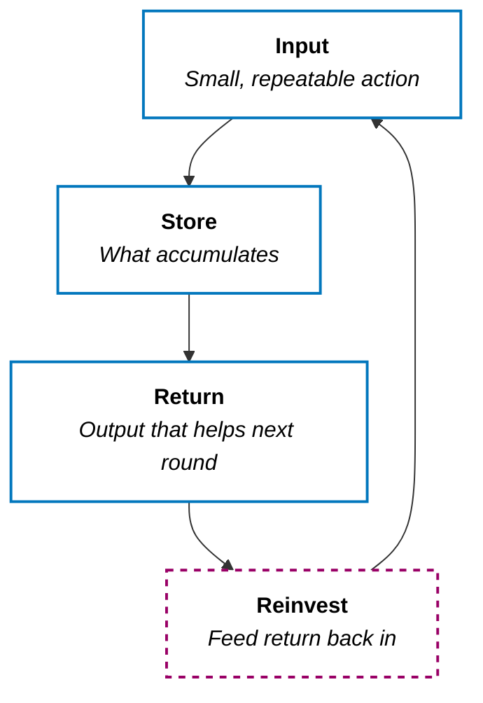

<!-- Open with a concrete scene: something tiny that later became huge — writing, skill, fitness, or a broken loop that never compounded. -->

Most people treat compounding like a finance slogan. Put money in, wait, get rich.

That's the wrong picture. Money is just the cleanest example. **The real unit of compounding is a loop that feeds itself.**

I wrote about this sideways in [Growth Mindset](/posts/growth-mindset/) and [Life Is an Infinite Game](/posts/life-infinite-game/) — 1% growth vs. 0%, trajectory over spikes. This post is the missing piece: **what the system actually looks like, and how to build one on purpose.**

> **Compounding is not a trait. It's a machine. If you don't design the machine, you don't get the interest.**

---

## The Core Model

<!-- Keep this short — one diagram + a few bullets. Don't over-explain. -->

A compounding system has four parts:

+ **Input** — something small enough that you can do it when life is loud
+ **Store** — where the work piles up (skill, notes, trust, code, audience, capital)
+ **Return** — what the store starts giving back (speed, clarity, options, leverage)
+ **Reinvest** — you use the return to make the next input easier or better

**Linear effort buys progress once. A compounding system buys progress that buys more progress.**

Break any of the four and the curve flattens:

| Break | What happens |
| :--- | :--- |
| **No input** | Nothing to compound — intention without deposits |
| **No store** | Effort evaporates — you redo the same day forever |
| **No return** | You grind but never get faster or freer |
| **No reinvest** | You cash out the gains as comfort, then restart from zero |

---

## How to Build One

<!-- Practical section — keep it to 3–4 moves, not a 10-step life OS. -->

### 1. Pick one loop, not ten

<!-- One domain for this season: writing, health, craft, relationships, career skill. -->

### 2. Shrink the input until it's boring

<!-- If the minimum viable deposit feels heroic, it won't survive a bad week. -->

### 3. Make the store visible

<!-- Repo, notebook, streak log, published posts — something that proves yesterday still exists. -->

### 4. Design the reinvest step on purpose

<!-- Don't hope the return "feels motivating." Decide how today's gain makes tomorrow's input cheaper. -->

---

## What Breaks Compounding

<!-- Short contrast — anti-patterns that look productive but reset the curve. -->

+ **Hero days** — huge spikes, long silence
+ **Starting over** — new system every month, empty store
+ **Optimizing before depositing** — polishing the machine instead of running it
+ **Consuming returns as dopamine** — celebrating progress so hard you stop producing

---

## The Takeaway

<!-- Land it in one tight paragraph + a closing blockquote. Tie back to showing up after a long pause if it fits. -->

> **You don't need a better year. You need a loop that survives an average week.**
