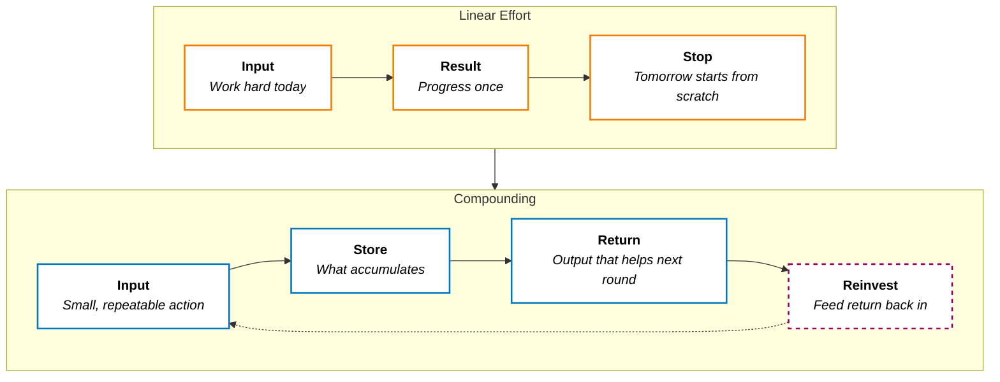

<!-- Open with a concrete scene: something tiny that later became huge — writing, skill, fitness, or a broken loop that never compounded. -->

Most people treat compounding like a finance slogan. Put money in, wait, get rich.

That's the wrong picture. Money is just the cleanest example. **The real unit of compounding is a loop that feeds itself.**

I wrote about this sideways in [Growth Mindset](/posts/growth-mindset/) and [Life Is an Infinite Game](/posts/life-infinite-game/) — 1% growth vs. 0%, trajectory over spikes. This post is the missing piece: **what the system actually looks like, and how to build one on purpose.**

> **Compounding is not a trait. It's a machine. If we don't design the machine, we don't get the interest.**

---

## The Core Model

A compounding system has four parts. The contrast with linear effort is clearest in **one** picture:

**Linear is a straight line that ends. Compounding is a circle that keeps getting paid.**

+ **Input** — something small enough that you can do it when life is loud
+ **Store** — where the work piles up (skill, notes, trust, code, audience, capital)
+ **Return** — what the store starts giving back (speed, clarity, options, leverage)
+ **Reinvest** — use the return to make the next input easier or better

Break any of the four and the curve flattens:

| Break | What happens |
| :--- | :--- |
| **No input** | Nothing to compound — intention without deposits |
| **No store** | Effort evaporates — you redo the same day forever |
| **No return** | You grind but never get faster or freer |
| **No reinvest** | You cash out the gains as comfort, then restart from zero |

---

## How to Build One

I don't start with a life OS. I start with **one loop I can actually run this season**.

### 1. Pick one loop, not ten

Writing. Fitness. A craft skill. One relationship habit. One career muscle.

If I try to compound everything at once, nothing gets enough deposits to start returning. I pick the domain that would quietly change the next year if it kept going — then I ignore the rest until this loop has a store.

### 2. Shrink the input until it's boring

The deposit has to survive a loud week: tired, busy, uninspired.

If the minimum version still feels heroic — "write 2,000 words," "train for an hour," "ship a feature" — I cut it again. Fifteen minutes. One paragraph. One push-up set. **Boring is the feature.** Boring means I can still make the deposit when motivation is gone.

### 3. Make the store visible

Compounding dies when yesterday disappears.

I need a place where deposits pile up in plain sight: a repo, a notebook, published posts, a simple log. If I can't point at the store, I'm doing linear effort with better branding — each day starts from zero even if it _feels_ productive.

### 4. Design the reinvest step on purpose

Returns don't automatically become tomorrow's advantage. I have to aim them.

After a writing session, the reinvest might be: leave a clearer outline for next time. After practice: note the one move that got easier, and start there tomorrow. After shipping: reuse the pattern instead of inventing a new one. **The question is always: how does today's return make the next input cheaper or better?**

---

## What Breaks Compounding

These look productive. They flatten the curve.

+ **Burst-and-vanish days** — crush one huge session, then go quiet for weeks. The spike feels like progress; the silence empties the loop.
+ **Starting over** — new system every month, empty store
+ **Meta-optimizing with an empty store** — tweaking the system, the stack, the ritual — instead of making the next deposit. I still want constant iteration; that belongs in **reinvest**, after real input has landed. Optimizing the loop is compounding. Optimizing a loop you haven't run is stalling.
+ **Consuming returns as dopamine** — celebrating progress so hard you stop producing

---

## The Takeaway

<!-- Land it in one tight paragraph + a closing blockquote. Tie back to showing up after a long pause if it fits. -->

> **I don't need a better year. I need a loop that survives an average week.**
