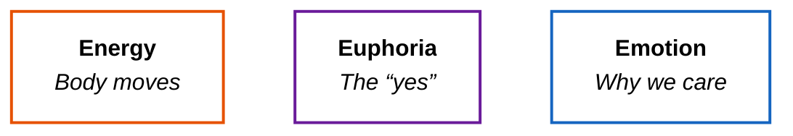

Trance job in three words:

**Energy. Euphoria. Emotion.**

Not a theory stack. A check. When a track hits — or misses — one of these three is usually doing the work, or failing to.

> **Trance is not “more drums.” Trance is three jobs on the floor — and the track has to deliver all three.**

---

## One Picture

Three **independent** dimensions — not a pipeline. Same dancefloor. Different questions.

| E | Floor question | Plain English |
| :--- | :--- | :--- |
| **Energy** | Does my body move? | Drive, lift, the ride |
| **Euphoria** | Do I get a “yes”? | Peak release when the Drop lands |
| **Emotion** | Do I care? | Tension, yearning, catharsis |

---

## Three Checks

**Energy** is the ride — kick, hats, build; the body moves before you name why. **Loud is volume. Energy is motion.**

**Euphoria** is the peak “yes” — when the Drop pays off what the Build promised, and the room blooms instead of just getting denser.

**Emotion** is why the floor stays — yearning harmony, a Breakdown with air, a melody that sticks on the train home.

Miss one and the track skews: no Emotion → sports; no Euphoria → jogging in place; no Energy → a sad piano in a warehouse.

---

## The Booth Test

When I listen, mix, or arrange:

**Which E is carrying this moment?**  
**Does the full phrase still deliver all three?**

| What you feel | Likely miss | Wrong fix | Better question |
| :--- | :--- | :--- | :--- |
| Body stuck | Energy | More reverb | Is the ride climbing? |
| Peak feels “meh” | Euphoria | Louder Drop | Did the Drop *pay off*? |
| Forget it tomorrow | Emotion | Bigger FX | Is there a story to care about? |

---

## The Takeaway

> **Three independent jobs. If the floor only gets one, the track isn’t finished — maybe it’s just loud.**
