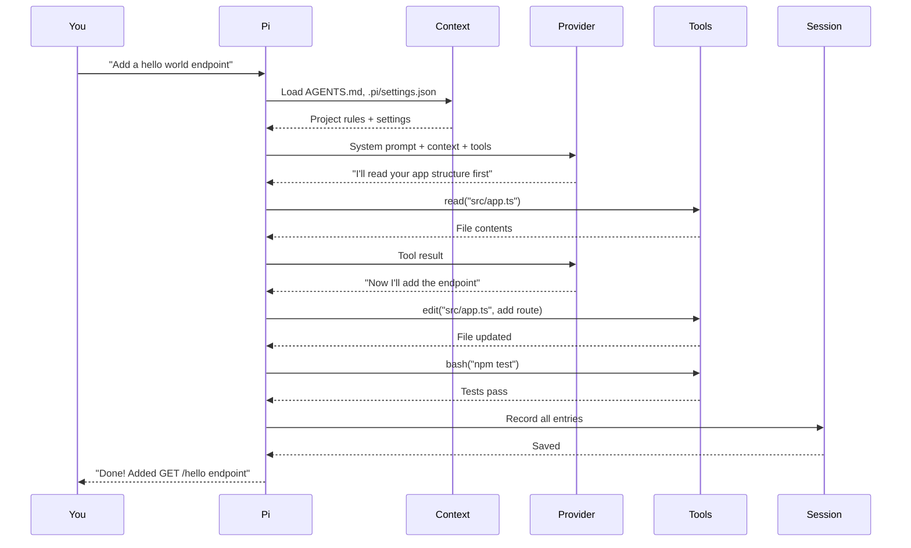
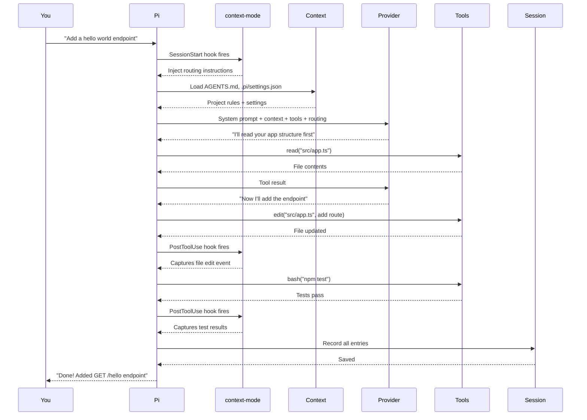
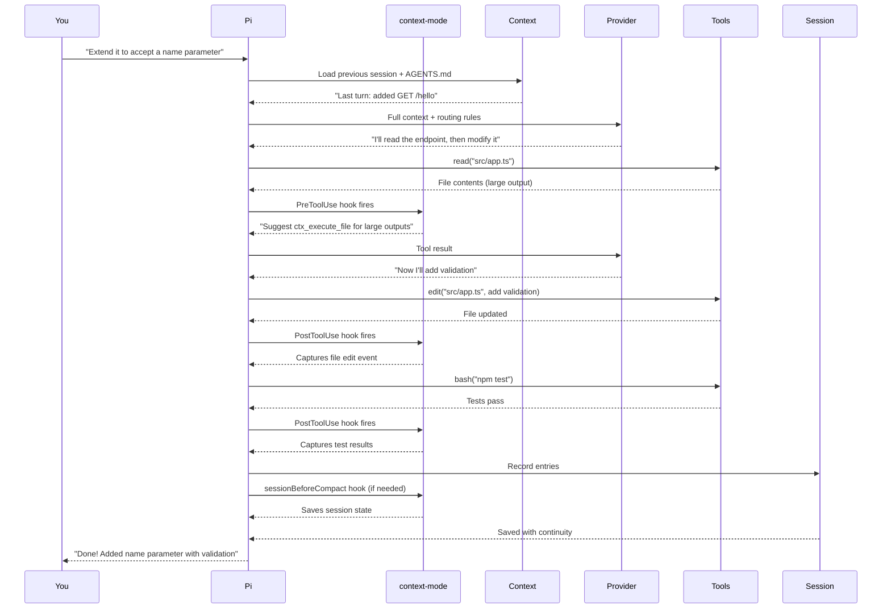
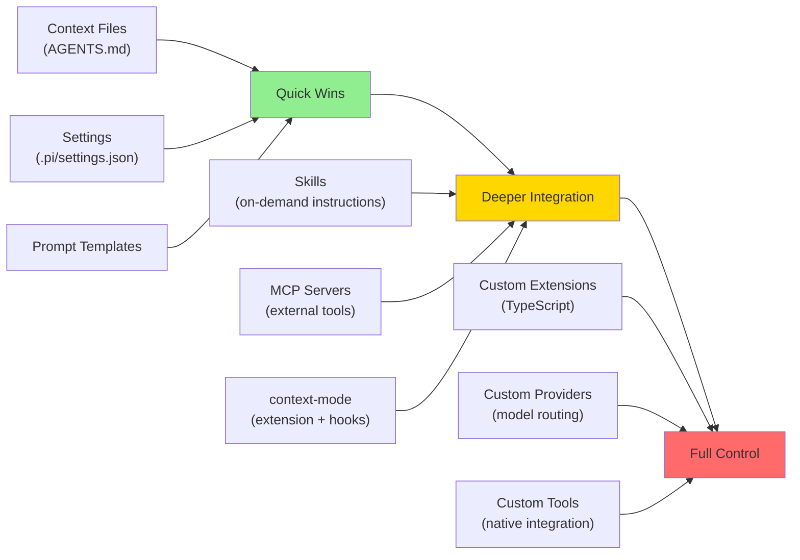

## Introduction

I used to depend on Cursor with auto models. Type a prompt, get code, move on.

Then I started using Pi. Same surface, but different. Pi suggested tools I didn't ask for. My context survived sessions that should have been forgotten. Extensions seemed to know what I was doing before I did.

I wanted to understand *how* it all worked — **where** each piece fits and **when** I could customize it.

This post is the map I built.

---

## Part 1: How Pi Works (Without Extensions)

Let's start with pure Pi — no extensions, no customizations. Just the core agent doing its job.

### The Request Lifecycle

Every time I talk to Pi, my request flows through seven stages:

```
┌─────────────────────────────────────────────────────────────┐
│  1. You type a prompt                                       │
└─────────────────────────────────────────────────────────────┘
         │
         ▼
┌─────────────────────────────────────────────────────────────┐
│  2. Pi gathers context                                      │
│     • AGENTS.md, settings, session history                  │
└─────────────────────────────────────────────────────────────┘
         │
         ▼
┌─────────────────────────────────────────────────────────────┐
│  3. Pi builds the request                                   │
│     • System prompt + tools + context                       │
└─────────────────────────────────────────────────────────────┘
         │
         ▼
┌─────────────────────────────────────────────────────────────┐
│  4. Provider sends to LLM                                   │
│     • OpenAI, Anthropic, etc.                               │
└─────────────────────────────────────────────────────────────┘
         │
         ▼
┌─────────────────────────────────────────────────────────────┐
│  5. LLM responds                                            │
│     • Text and/or tool calls                                │
└─────────────────────────────────────────────────────────────┘
         │
         ▼
    ┌────┴────┐
    │  Tool   │
    │  calls? │
    └────┬────┘
     Yes │     No
         │     │
         ▼     │
┌──────────────────┐
│  6. Pi executes  │
│     tools        │
│  • read, edit,   │
│    bash, etc.    │
└──────────────────┘
         │
         ▼
┌──────────────────┐
│  7. Record       │
│     results      │
└──────────────────┘
         │
         ▼
    ┌────┴────┐
    │  More   │
    │  turns? │
    └────┬────┘
     Yes │     No
         │     │
         ▼     ▼
    [Back to   ┌──────────────────┐
     step 3]   │  8. Save to      │
               │     session      │
               │  • JSONL file    │
               └──────────────────┘
```

Each box is a place where I can customize behavior. But first, let's see it in action.

### A Concrete Example

You're building an Express app. You ask Pi: **"Add a hello world endpoint"**

Here's what happens:



**Step by step**:

1. **Context**: Pi loads my project's `AGENTS.md` and `.pi/settings.json` — these tell Pi about my conventions
2. **Provider**: The LLM decides to read my app first (smart move)
3. **Tools**: Pi executes three calls in sequence — read, edit, test
4. **Session**: Everything is recorded so Pi remembers this work next time

That's pure Pi. The model decided the sequence, Pi executed the tools, and the session was saved. No magic, no extensions.

---

## Part 2: Where Extensions Plug In

Now let's talk about extensions.

### What Are Extensions?

Extensions are TypeScript modules that **hook into Pi's lifecycle** at specific points. They can:

- Add custom tools
- Intercept tool calls before or after they execute
- Transform context
- Register commands and shortcuts

They run **inside Pi's process** — not as external services, but as native code with deep access to the agent's internals.

### Meet `context-mode`

**context-mode** is an extension I use daily. It does three things:

1. **Tool routing**: Suggests which tool to use for different tasks
2. **Context savings**: Compresses large outputs to save tokens
3. **Session continuity**: Preserves context across compactions

Without context-mode, Pi works fine. With it, Pi becomes more efficient and my context persists better across long sessions.

### Meet `pi-memory`

**pi-memory** is another popular extension (40K+ monthly downloads as of Oct 7, 2026). It gives Pi a persistent memory across sessions:

- **Long-term memory**: Stores decisions, preferences, and facts in `MEMORY.md`
- **Daily logs**: Automatically records what happened each day
- **Scratchpad**: A checklist of things to come back to
- **Semantic search**: With optional `qmd`, I can search across all memories

**Example**:
```
# Session 1
me ▸ I always use pnpm in this repo, never npm. Remember that.
pi  ▸ Got it — saved to long-term memory.

# …days later, brand new session…
me  add prettier as a dev dependency
pi   pnpm add -D prettier
      (recalled my package-manager preference — no reminder needed)
```

Both extensions use the same core mechanism: **hooks into Pi's lifecycle**.

### The Extension Hook Points

Extensions plug into Pi at specific moments. Here's where context-mode and pi-memory hook in:

```
Session Lifecycle:

  [Session Starts]
       │
       ├──→ context-mode: injects routing instructions
       └──→ pi-memory: loads MEMORY.md into context
       │
  [User sends message]
       │
  [Tool call about to execute]
       │
       └──→ context-mode: suggests better tools (PreToolUse)
       │
  [Tool executes]
       │
  [Tool completes]
       │
       ├──→ context-mode: captures events (PostToolUse)
       └──→ pi-memory: writes to daily log
       │
  [Results recorded]
       │
  {Context too long?}
       │
       ├──→ Yes → [sessionBeforeCompact hook]
       │              ├──→ context-mode: saves session state
       │              └──→ pi-memory: creates handoff entry
       │
       └──→ No → [Session continues]
       │
  [Session ends]
       │
       └──→ pi-memory: writes exit summary
```

**Key insight**: Both extensions use the same hook system, but at different points. context-mode focuses on **tool execution** (pre/post hooks), while pi-memory focuses on **session boundaries** (start/end/compaction).

### How They Store Data

```
context-mode Storage:
  ~/.context-mode/content/
  ├── sessions.db          # Session events (SQLite)
  ├── content.db           # Indexed web pages, docs (SQLite)
  └── stats.db             # Usage statistics (SQLite)

pi-memory Storage:
  ~/.pi/agent/memory/
  ├── MEMORY.md            # Long-term facts, decisions
  ├── SCRATCHPAD.md        # Todo checklist
  └── daily/
      ├── 2026-10-07.md    # Today's log
      └── 2026-10-06.md    # Yesterday's log
```

**Why it matters**: context-mode uses SQLite for fast indexing and search. pi-memory uses plain Markdown so I can `cat`, `git commit`, or edit the files directly. Both approaches have trade-offs.

---

## Part 2.5: The Hook System

Hooks are **callback functions** that Pi calls at specific moments. Extensions register these to intercept or augment Pi's behavior.

### The Five Hook Points

```
1. sessionStart — Inject instructions, load context
2. preToolUse — Suggest better tools, deny dangerous commands
3. postToolUse — Capture events, update state
4. sessionBeforeCompact — Save state, create handoff
5. exitSummary — Write summary, cleanup
```

### How Extensions Register Hooks

```typescript
pi.on('sessionStart', async (event, ctx) => {
  return { instructions: 'Use ctx_execute for large outputs' };
});

pi.on('preToolUse', async (event, ctx) => {
  const { toolName, toolInput } = event;
  if (toolName === 'read' && toolInput.path.endsWith('.log')) {
    return { redirect: 'ctx_execute_file', newInput: toolInput };
  }
});
```

This is what makes Pi truly extensible — not just new tools, but the ability to modify behavior at every stage.

---

## Part 3: The Same Example, With context-mode

Let's revisit the hello world example with context-mode installed.

### Request 1: "Add a hello world endpoint"



**What changed**: context-mode injected routing instructions at the start and captured events after each tool call. The output looks the same, but context-mode is silently working in the background.

### Request 2: "Now extend it to accept a name parameter"

On the follow-up request, context-mode becomes more active:



**What changed in the follow-up**:

1. **Context Assembly**: Pi loaded the previous session — it remembered the first request
2. **PreToolUse hook**: When `read` returned a large file, context-mode suggested using `ctx_execute_file`
3. **PostToolUse hooks**: Captured every tool event
4. **sessionBeforeCompact hook**: If context gets too long, context-mode saves state for continuity

**The pattern**: In Request 1, context-mode was mostly silent. In Request 2, it actively participated — providing routing guidance, suggesting better tools, and ensuring continuity.

---

## Part 4: The Customization Points

Now that I've seen Pi in action, here's where I can customize each stage:

```
┌─────────────────────────────────────────────────────────────────┐
│  Stage 1: User Input                                            │
│  Customize: Prompt templates                                    │
└─────────────────────────────────────────────────────────────────┘
         │
         ▼
┌─────────────────────────────────────────────────────────────────┐
│  Stage 2: Context Assembly                                      │
│  Customize: AGENTS.md, extensions, skills                       │
└─────────────────────────────────────────────────────────────────┘
         │
         ▼
┌─────────────────────────────────────────────────────────────────┐
│  Stage 3: Model Request                                         │
│  Customize: Provider, settings                                  │
└─────────────────────────────────────────────────────────────────┘
         │
         ▼
┌─────────────────────────────────────────────────────────────────┐
│  Stage 4: Provider & Response                                   │
│  Customize: Custom providers                                    │
└─────────────────────────────────────────────────────────────────┘
         │
         ▼
┌─────────────────────────────────────────────────────────────────┐
│  Stage 5: Tool Execution  ⚡⚡                                    │
│  Customize: Custom tools, permissions, hooks                    │
│  ← Most customization happens here!                             │
└─────────────────────────────────────────────────────────────────┘
         │
         ▼
┌─────────────────────────────────────────────────────────────────┐
│  Stage 6: Session Storage  ⚡                                    │
│  Customize: Branching, compaction hooks                         │
└─────────────────────────────────────────────────────────────────┘
```

**Color guide**:
- **Stages 1-2** (green): What Pi knows
- **Stages 3-4** (blue): Which model Pi uses
- **Stage 5** (yellow): Where most customization happens — tools, permissions, and hooks
- **Stage 6** (red): How Pi remembers

Let me walk through each stage:

### Stage 1: User Input

My editor input goes through prompt templates and becomes a user message.

**Customize with**: Prompt templates

### Stage 2: Context Assembly

Pi builds the system prompt from its base instructions and discovered context files.

**Customize with**:
- **Context files**: Drop `AGENTS.md`, `CLAUDE.md`, or `CONTEXT.md` in my project root
- **Extensions**: Can add instructions or transform context
- **Skills**: Provide on-demand instructions

**context-mode hooks here**: `sessionStart` hook injects routing instructions

**Tip**: Drop a `.pi/AGENTS.md` file in my project and Pi will automatically include it in every request.

### Stage 3: Model Request

Pi builds a model request and sends it through the selected provider.

**Customize with**:
- **Provider selection**: Which LLM provider to use
- **Model overrides**: Per-model token budgets
- **Settings**: Two locations:
  - **Global**: `~/.pi/agent/settings.json`
  - **Project-level**: `<project>/.pi/settings.json`

**My preference**: Project-wise settings so configurations don't leak between projects.

### Stage 4: Provider & Response

The provider streams an assistant response.

**Customize with**: Custom providers (for non-standard LLMs)

### Stage 5: Tool Execution ⚡

Pi executes each tool call and records the results.

**Customize with**:
- **Custom tools** (via extensions)
- **Tool permissions**
- **Event handlers**: `sessionStart`, `preToolUse`, `postToolUse`

**context-mode hooks here**:

#### PreToolUse Hook
Intercepts tool calls before execution. Injects routing guidance like "Wrap large external-MCP payloads in `ctx_execute`".

#### PostToolUse Hook
Captures tool events after execution: file edits, git operations, errors, tasks.

#### Tool Hierarchy
context-mode registers 11 MCP tools:

```
ctx_batch_execute (highest)
  ─ ctx_execute
        ── ctx_execute_file
              ── ctx_search (lowest)
```

**My daily routing**:
- Read/edit files → `ctx_execute_file`
- Multi-command research → `ctx_batch_execute`
- Web pages → `ctx_fetch_and_index` then `ctx_search`
- Index docs → `ctx_index`

### Stage 6: Session Storage ⚡

Persistent sessions are JSONL files. Compaction inserts a summary entry that replaces older messages.

**Customize with**:
- **Branching**: `/tree`, `/fork`, `/clone`
- **Compaction hooks**: `sessionBeforeCompact`

**context-mode hooks here**: `sessionBeforeCompact` captures session state, enabling continuity

**Tip**: When Pi compacts, context-mode saves the session state so I can restore it later.

---

## Part 5: The Customization Spectrum

Customization comes in three levels:



**My journey**: Context files first (5 minutes), then context-mode (10 minutes). I haven't written custom extensions yet, but now I know where to plug in.

---

## Practical Examples

| Goal | Solution | Extension | Level |
|------|----------|-----------|-------|
| Add custom instructions per project | Drop `AGENTS.md` in project root | None | Quick Win |
| Set project-specific settings | Create `<project>/.pi/settings.json` | None | Quick Win |
| Remember preferences across sessions | `memory_write` tool | pi-memory | Quick Win |
| Intercept tool calls | `sessionStart`/`preToolUse`/`postToolUse` hooks | context-mode | Deeper |
| Change how compaction works | `sessionBeforeCompact` hook | context-mode, pi-memory | Deeper |
| Fetch docs once, search many times | `ctx_fetch_and_index` then `ctx_search` | context-mode | Deeper |
| Search across all memories | `memory_search` (requires qmd) | pi-memory | Deeper |
| Add a new tool | Extension with tool registration | Custom | Full Control |
| Custom model routing | Custom provider extension | Custom | Full Control |

---

## Conclusion

Pi is a **programmable agent**, not just a chat interface. The lifecycle diagram is my map — every box is a customization point.

**Where I started**:
1. Dropped an `AGENTS.md` file in my project (5 minutes)
2. Installed context-mode for tool routing and session continuity (10 minutes)
3. Explored the settings hierarchy (`~/.pi` vs `<project>/.pi/`) (15 minutes)

The difference between using a tool and mastering it is understanding how it works. Now I have the map.

---

## Further Reading

- [How Pi Works](https://pi.dev/docs/latest/how-pi-works) - Official documentation
- [Understanding Compaction in Pi](/posts/understanding-compaction-in-pi/) - My deep dive on context management
- [Sessions and Context](https://pi.dev/docs/latest/sessions) - User workflow guide
- [context-mode Package](https://pi.dev/packages/context-mode) - The extension I use daily
- [Extensions](https://pi.dev/docs/latest/extensions) - Building my own extensions
